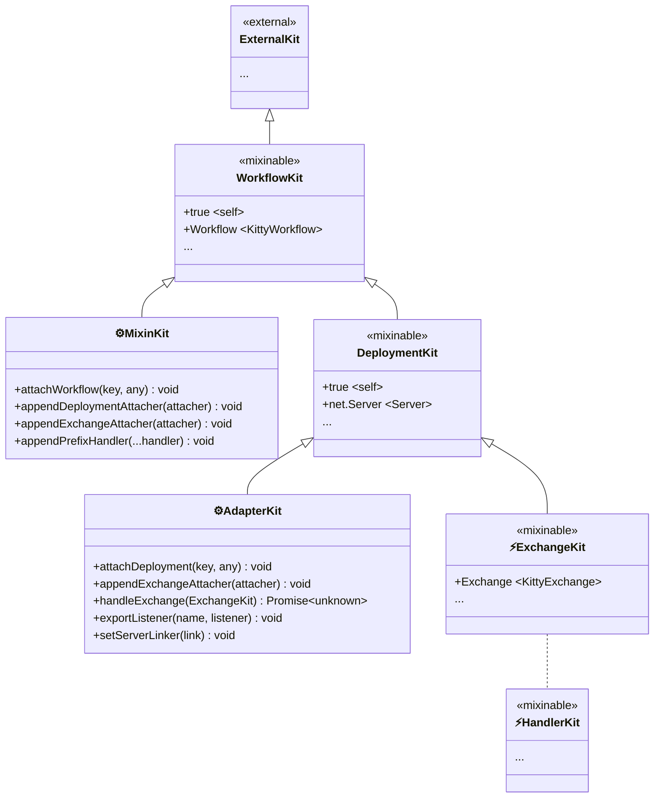

# KittyWorkflow Stable Architecture Notes

This file records decisions that are stable enough for long-term
reference.

The design draft in DESIGN.md is still the primary AI collaboration
workspace. When a section is considered stable, copy the final wording
here.

## Document Roles

- DESIGN.md: exploration draft, alternatives, open questions.
- ARCHITECTURE.md: stable contracts, settled naming, fixed invariants.

## Architecture Layering

`KittyWorkflow` is split into two layers:

- **Abstract layer** (`Abstract.mjs`): Defines the lifecycle template
  — `constructor(kit)` → `use(handler)` → `finalize()` →
  `compile()`/`deploy()`. Exposes extension point hooks (`_I`
  namespace) for subclasses to fill in: compose extension and artifact
  compilation. Installs the base `useWorkflow` identity capability on
  `WorkflowKit`. The abstract layer knows nothing about mixin, adapter
  registry, or temporary adapters — it is purely an extensible
  skeleton.

- **Composition layer** (`Compound.mjs`): Extends the abstract layer
  and implements two orthogonal domains — **Mixin** and **Adapter** —
  each responsible for a distinct kind of capability injection. Owns
  `adapt(options)` for ephemeral deployment. `MixinKit` and
  `AdapterKit` act as attachment ports: scoped, kit-backed facades
  over the workflow assembly surface.

Extension point hooks (`_I` namespace):

| Hook                  | Implemented by    | Called at                                             |
| --------------------- | ----------------- | ----------------------------------------------------- |
| `_I.COMPOSE.EXTEND`   | Composition layer | `finalize()` — prepends prefix handlers               |
| `_I.COMPILE_ARTIFACT` | Composition layer | `compile()` / `deploy()` — builds deployment artifact |

## Lifecycle

### Abstract layer

```text
constructor(kit) → use(handler)* → finalize()
  → deploy(server) / compile(server)
  → (request) → ExchangeKit
```

- **Construction**: Accepts a kit, derives `WorkflowKit` from it via
  `kit('Kitty<Workflow>')`, stores the workflow identity on
  `WorkflowKit`.
- **Orchestration**: `use(handler)` appends handlers to the handler
  list. Returns `this` for chaining. Handlers are validated: must be
  functions with arity ≤ 2.
- **Finalization**: `finalize()` freezes the handler list, composes
  prefix + main handlers into a single workflow, then freezes the
  instance. After this, `use()` and `mixin()` are rejected.
- **Compile**: `compile(server)` produces the deployment artifact's
  `listeners` record without linking to the server.
- **Deploy**: `deploy(server)` compiles the artifact, then calls
  `link()` to wire the server via the composed linker chain.

### Composition layer extensions

The full lifecycle in `CompoundKittyWorkflow`:

```text
constructor(kit) → mixin(installer)* → use(handler)* → finalize()
  → deploy(server) / compile(server) / adapt(options)
  → Adapter.Registry / temporary adapter → DeploymentKit prepared
  → adapter.install(AdapterKit) → compile phase → link compiled
  → link() → server wired via linker chain
  → (request) → ExchangeKit → Exchange validated → workflow pipeline
```

## Kit Hierarchy

When a `KittyWorkflow` is constructed, it derives a child kit from
the user-supplied kit to scope its own context. Deployment further
creates a deployment-level child kit. The inheritance chain:



This diagram is also an authority boundary. Handler code travels through
the `ExchangeKit` branch and does not naturally receive `MixinKit` or
`AdapterKit`. Those kits are attachment ports managed by their suppliers.
If a supplier wants handler code to adjust a feature, it must explicitly
export an adjustment function that accepts workflow identity. Handler
code can read that identity with `useWorkflow(ExchangeKit)` and call the
supplier API; no additional kit-visible adjuster path is required.

The full hierarchy is a core-level view, not a required mental model for
every downstream role. Handler authors normally see only their current
kit and supplier-provided `use*()` functions. Mixin suppliers work with
`MixinKit` and guarded writes toward `WorkflowKit`. Adapter suppliers
work with `AdapterKit`, `DeploymentKit`, and `ExchangeKit` because they
own the protocol bridge. Each role only needs the part of the hierarchy
that it can actually use.

### Kittable Items

- **External kit**: Passed to `constructor(kit)`. Defaults to
  `Kit.global`, but callers can supply a custom kit pre-loaded with
  specialized dependencies and services for the workflow's runtime
  environment.
- **`KitWorkflow`** (workflow scope): Derived from the external kit via
  `kit('KitWorkflow')`. Holds the workflow object itself (`<$I_WORKFLOW>`)
  as a capability for mixin and adapter code that needs to reach the
  identity without coupling to the implementation class.
- **`Kitty<Mixin>`** (MixinKit): Derived from `KitWorkflow` per
  `mixin()` call via `kit('Kitty<Mixin>')`. Passed to the installer
  function, it carries `appendPrefixHandler`, `attachWorkflow`,
  `appendDeploymentAttacher`, and `appendExchangeAttacher` as its mixin
  authoring API.
- **`Kitty<Deployment>`** (deployment scope): Derived from `KitWorkflow`
  at deploy time via `kit('Kitty<Deployment>')`. The adapter's recipe
  is bound to this kit — the adapter never touches the Workflow-level
  kit. Also serves as the compose context for the linker chain during
  deploy (`artifact.link()`).
- **ExchangeKit** (per-exchange scope): Derived from
  `Kitty<Deployment>` per-request when a request arrives. Provides
  exchange-scoped context including request/response APIs (`Method`,
  `URL`, `Status`, `Request`, `Response`, etc.). Created and disposed
  per HTTP exchange. Unlike parent kits (created once at setup),
  ExchangeKit is **frequently created** — one per incoming request.
  The concrete implementation uses the `Exchange` abstraction
  (`Exchange/` directory) to decouple from server-specific protocols.
- **HandlerKit** (conceptual, optional): Any handler inside the
  Exchange phase may further derive a child kit for sub-capability
  isolation. This is entirely at the handler's discretion — the
  framework does not mandate or limit the depth of derivation. This
  enables features to be composed as **building blocks** at the
  handler level, not just at the framework level. Created per-handler
  invocation when derived, so also **frequently created**.

  > HandlerKit is shown with a dotted line because it **may not exist**
  > at all — a handler that does not call `next(kit)` or derive a child
  > kit simply does not create this layer. The diagram includes it for
  > conceptual completeness, not as a mandatory scope.

## Stable Terminology

- Exchange: one HTTP request and its response as one runtime unit.
- ExchangeKit: the per-exchange kit derived from DeploymentKit.
- AdapterKit: adapter bridge kit for listener export and server linking.
- DeploymentKit: per-server deployment scope, parent of ExchangeKit;
  also the compose context for the linker chain during deploy.

## Stable Invariants

- Workflow core does not hardcode protocol behavior.
- Adapters map protocol events to ExchangeKit and enter workflow through
  handleExchange.
- Exchange state access is mediated through the Exchange abstraction.
- Naming uses Exchange consistently; transaction terminology is retired.
- **Adapters support decoration**: a decorator chain can have multiple
  layers registered for the same server constructor. Each layer
  independently receives an `AdapterKit` and contributes listeners,
  attachers, and a linker. Kitty provides composition for both
  attachers (`appendExchangeAttacher`) and linkers (`setServerLinker`
  via LIFO stack + `compose`). Downstream adapters control their own
  decoration order and policy.

## Mixin Domain

A mixin is an **installer function** that receives a `MixinKit`
derived from `WorkflowKit` and installs capabilities onto kit layers
or registers handlers.

### MixinKit API

`MixinKit` is derived from `WorkflowKit` via `kit('Kitty<Mixin>')`.
Methods are set directly on the kit proxy. All methods guard against
post-finalization calls via `this[$I.ASSERT.NOT_FINALIZED]()`.

| Method                                     | Behavior                                                                                 |
| ------------------------------------------ | ---------------------------------------------------------------------------------------- |
| `mixinKit.attachWorkflow(key, value)`      | Attaches a dependency to `WorkflowKit`, inherited by all downstream kits                 |
| `mixinKit.appendDeploymentAttacher(fn)`    | Registers an attacher to run against `DeploymentKit` at deploy time                      |
| `mixinKit.appendExchangeAttacher(fn)`      | Registers an attacher to run against each `ExchangeKit` at runtime                       |
| `mixinKit.appendPrefixHandler(...handler)` | Registers handler(s) into the prefix handler sequence, composed before the main sequence |

### Execution order at deploy

```text
1. Create DeploymentKit from WorkflowKit
2. Adapter.install(AdapterKit) — installs low-level protocol API,
   registers exchange attachers, exports listeners and linker
3. Adapter exchange attachers execute on DeploymentKit
4. Mixin deployment attachers execute on DeploymentKit
5. Artifact is finalized and linked to the server
```

### Runtime exchange attacher execution order

When an exchange arrives via `handleExchange`:

```text
1. ExchangeKit validated (handleExchange guardrails)
2. Adapter exchange attachers  → abstract Exchange foundation
3. Mixin exchange attachers    → concrete per-exchange extensions
4. Workflow handler pipeline
```

### Relationship with `use()`

`use(handler)` adds handlers to the **main handler sequence**.
`mixinKit.appendPrefixHandler(handler)` adds to the **prefix handler
sequence**. Both are composed together at `finalize()` — prefix first,
then main. MixinKit does not provide a `use()` shortcut: mixins
install infrastructure capabilities that must reside outside the
business pipeline, and restricting to `appendPrefixHandler` makes the
wrapping order explicit.

## Adapter Domain

The Adapter domain is responsible for **server-type-specific protocol
bridging** — translating raw events of a particular server
implementation into the uniform `Exchange` abstraction.

### Adapter Registration

Adapters are registered globally via
`Adapter.Registry.register(options)`:

| Option        | Description                                                       |
| ------------- | ----------------------------------------------------------------- |
| `constructor` | Subclass of `net.Server` that this adapter targets                |
| `name`        | Logical adapter identifier (string)                               |
| `install`     | Function `(AdapterKit) => void` that installs deployment behavior |

### Lookup

Adapter resolution follows a two-level lookup:

1. **Instance-level** (via `associate`): Check if the server instance
   has an explicitly associated adapter. Set by the `adapt()` path
   for one-off deployments.
2. **Constructor-level** (via `register`): Fall back to matching
   `server.constructor` (via `instanceof`) against globally registered
   adapters.

`getByServer(server)` checks instance map first, then walks the
registry. This covers two usage patterns:

- **Framework-level distribution**: Library authors register adapters
  for standard server constructors (e.g. `http.Server`). Downstream
  code uses `deploy(server)` and gets the right adapter automatically.
- **Per-instance override**: Advanced users with custom server
  subclasses or temporary setups use `adapt()` to bind an adapter
  directly to a specific instance, bypassing global registration.

The registry entry stores `{ name, install }`:

- `name`: human-readable label; may carry variant/modifier markers for
  adapter composition scenarios.
- `install`: the function that populates listeners and linkers.

### AdapterKit API

When `adapter.install(AdapterKit)` is invoked, it receives an
`AdapterKit` derived from `DeploymentKit`. It is a one-time isolation
port — adapter authors cannot mutate `DeploymentKit` directly.

| Method                                           | Behavior                                                                                                   |
| ------------------------------------------------ | ---------------------------------------------------------------------------------------------------------- |
| `adapterKit.exportListener(eventName, listener)` | Registers a named event listener for the output listeners record                                           |
| `adapterKit.setServerLinker(link)`               | Pushes a linker function onto a LIFO stack; linkers capture server and handlers via closure during install |
| `adapterKit.handleExchange(ExchangeKit)`         | Passes an ExchangeKit into the workflow pipeline after validation                                          |
| `adapterKit.attachDeployment(key, value)`        | Attaches a value to `DeploymentKit` for downstream use                                                     |
| `adapterKit.appendExchangeAttacher(fn)`          | Registers an attacher for each `ExchangeKit` at runtime                                                    |

All methods guard against post-compilation calls via an internal
`compiled` flag.

### Adapter format in registry

```js
registry.set(Constructor, {
  name: 'http',
  install(AdapterKit) {
    /* ... */
  },
});
```

The registry stores `install` and `name`. `listeners` and `link` are
produced at compile time by executing the `install` function against
an `AdapterKit`.

## Exchange Template

The Exchange abstraction (`Exchange/Abstract.mjs`) is part of the
`workflow` core package, not an independent sub-package. Every adapter
must install an `Exchange` instance on `ExchangeKit` before calling
`handleExchange`.

### Exchange public API

```text
exchange.method          → string              (readonly)
exchange.mode            → string              (readonly)
exchange.url             → URL                 (readonly)
exchange.statusCode      → number              (readonly)
exchange.statusText      → string              (readonly)
exchange.setStatus(code)  → void               (write)
exchange.isConsumed       → boolean            (readonly)
exchange.isFinished       → boolean            (readonly)
exchange.server           → net.Server         (readonly)
exchange.protocol         → 'http:' | 'https:' (readonly)
exchange.httpVersion      → string             (readonly)
exchange.request          → KittyExchangeRequest  (readonly)
exchange.response         → KittyExchangeResponse (read/write)
```

KittyExchange extends `EventTarget`. Lifecycle events:

| Event   | Dispatcher                     | Meaning                 |
| ------- | ------------------------------ | ----------------------- |
| `close` | `handleExchange` finally block | workflow pipeline ended |

### Member ownership

Primitive member definitions are placed on the object with the highest
conceptual relevance. Exchange proxies unambiguous high-frequency
members; ambiguous names require explicit `request.*` / `response.*`.

```text
Exchange-owned concepts
├── server, protocol, httpVersion

Request concepts     → KittyExchangeRequest
├── method, mode, url, header, body.data, isConsumed

Response concepts    → KittyExchangeResponse
├── statusCode, statusText, header, body.data, setStatus, isFinished
```

### Defense layers

1. **Abstract proxy**: Parser guards (e.g. `P.HTTPStatusCode`) validate
   types at construction time via `es-abstract`.
2. **Adapter error guard**: `Guard` delegates wrap every `_I` delegation
   through `AdapterGuard({ message, member })`. Adapter-origin exceptions
   are rethrown with `[AdapterImplementationError]` prefix.
3. **Public method self-check**: Runtime type assertions
   (`Assert.HeaderName`, `Assert.HeaderValue`, `Assert.HTTPStatusCode`)
   on method arguments independent of the Abstract proxy.

### Exchange identity

Exchange construction validates identity-object consumption via
`CONSUMED_IDENTITY` WeakSet. An identity object used for one Exchange
cannot be reused for another Exchange instance.

### Exchange Implement

Concrete Exchange implementations are created via
`Exchange.Implement(options)`, which accepts a plain object specifying
getters/setters for all abstract members:

- `meta`, `method`, `URL`, `status`, `finished`
- `request.header` (get, keys), `request.body.data` (get)
- `response.header` (get, keys, set, delete), `response.body.data` (get, set)

This factory uses `SubConstructorProxy` from `@produck/es-abstract` to
generate a functional Exchange subclass.

## Adapter/Workflow Bridge Protocol

## Supplier Configuration (`tune` Pattern)

Suppliers (Mixin, Adapter, Exchange) own their configuration grammar.
No central options bag, no `configure(workflow, patch)` protocol.
Each supplier exposes named `tune*` functions keyed by workflow
identity through a private `WeakMap`.

### Vocabulary

| Verb     | Domain     | Meaning                                |
| -------- | ---------- | -------------------------------------- |
| `attach` | Capability | Install a dependency or extension hook |
| `tune`   | Parameter  | Adjust a supplier-owned runtime knob   |

### Mechanism

```text
Supplier (e.g. Exchange.Configuration, cookie Mixin, cors Adapter)
  → private WeakMap<workflow, config>
  → install(WorkflowKit, workflow) — called by core at construction
  → tuneTimeout(workflow, value) — called by user post-construction
```

### Consumer API

```js
import { Configuration } from '@produck/kitty-workflow';

const workflow = new KittyWorkflow(kit);
Configuration.tuneTimeout(workflow, 300);
workflow.use(handler).finalize();
```

### Supplier Implementation Template

```js
const map = new WeakMap();

export function install(WorkflowKit, workflow) {
  const config = new Config();
  WorkflowKit[CAP] = config; // kit-chain access for handler use
  map.set(workflow, config); // weak-map access for user tune
}

export function tuneFoo(workflow, value) {
  const config = map.get(workflow);
  if (config === undefined) {
    throw new Error('Feature has not been installed on this workflow.');
  }
  config.foo = value;
}
```

### Design Rationale

- **Supplier-owned grammar**: Each supplier defines its own `tune*`
  signatures. No shared option shape to standardise across unrelated
  domains.
- **WeakMap identity guard**: A proxied workflow wrapper will not map
  to any installed config — no additional brand check is required.
- **Core ignorance**: `KittyWorkflow` core never inspects or validates
  supplier options.

The `handleExchange` function is the sole bridge between the Adapter
layer (protocol-specific) and the Workflow layer (application logic,
server-agnostic).

### Contract

- **Adapter recipe** receives an `AdapterKit`. It must:
  1. Attach protocol-specific listeners to the server via
     `exportListener`.
  2. On each incoming exchange, derive an `ExchangeKit` from
     `DeploymentKit`, install an `Exchange` instance, and call
     `adapterKit.handleExchange(ExchangeKit)`.
- **handle** validates the ExchangeKit against guardrails, runs
  exchange attachers (adapter then mixin), then executes the composed
  workflow pipeline.

### Protocol invariant

- Adapter does not know what handlers are registered via `use()` or
  what plugins are installed. It interacts only with `DeploymentKit`
  and `ExchangeKit`.
- Workflow does not know the server type, event model, or transport
  protocol. It interacts only with capabilities installed on its kit.

### Deployment flow

```text
deploy(server) / adapt(options).deploy(server)
  │
  ├─ 1. Create DeploymentKit from WorkflowKit
  ├─ 2. Store server on DeploymentKit (Symbol-keyed)
  ├─ 3. Look up adapter (registry or per-instance)
  ├─ 4. Create AdapterKit from DeploymentKit
  ├─ 5. adapter.install(AdapterKit)
  │      └─ Produces deployment artifact { listeners, link }
  ├─ 6. link(server, listeners)
  └─ 7. Run mixin deployment attachers on DeploymentKit
```

`compile()` stops after step 5 and returns `listeners`. `deploy()`
continues through step 7.

## Deployment Paths

Three deployment paths serve different scenarios:

| Property       | `deploy(server)`                        | `compile(server)`                       | `adapt(options)`                                       |
| -------------- | --------------------------------------- | --------------------------------------- | ------------------------------------------------------ |
| Adapter source | Global registry (by server constructor) | Global registry (by server constructor) | Inline `options` (per-instance override)               |
| Links server   | Yes (`link` called)                     | No (returns raw listeners)              | `compile` or `deploy`                                  |
| Reusability    | Unlimited calls                         | Unlimited calls                         | Single-use; exactly one of `compile`/`deploy` per call |
| Timing         | No constraint                           | No constraint                           | Must be consumed synchronously (microtask-guarded)     |

### `adapt()` single-use contract

The scope returned by `adapt()` enforces:

- `queueMicrotask` expires the availability window — the returned
  operation must be called synchronously at the call site.
- A `consumed` flag prevents double-call of either `compile` or
  `deploy`.
- `compile` and `deploy` share a single execution lock — only one
  may be called per `adapt()` invocation.

## Adapter Artifact Split

Adapter compilation produces an artifact with two fields:

```js
{
  listeners,  // Record<string | symbol, Function>
  link,       // (server, listeners) => unknown
}
```

- **`listeners`**: Protocol event handlers, e.g.
  `{ request: (req, res) => {}, upgrade: (req, socket, head) => {} }`.
  Returned by `compile()` for manual wiring.
- **`link`**: Binds listeners to a concrete server instance via
  `server.on(event, listener)`. Called by `deploy()`. Not a Kit recipe
  — receives server and listeners directly.
- The linker stack is LIFO: each `setServerLinker` call unshifts,
  and final `link` is `compose(...linkList)`.

## handleExchange Guardrails

handleExchange is the adapter-to-workflow bridge. It must reject bad
adapter input before any workflow handler runs.

- ExchangeKit must be derived from the current DeploymentKit.
- ExchangeKit must not be the DeploymentKit itself.
- Exchange must already be installed on ExchangeKit.
- Installed Exchange must be an instance of the Exchange abstraction.
- Exchange must be linked to the current server.
- The same Exchange instance must not be dispatched more than once.

Responsibility boundary:

- Violations at this boundary are adapter errors, not handler errors.
- `.use()` handlers may assume a validated ExchangeKit once workflow
  execution begins.

## Duplicate-Consumption Principle

Kitty uses two binding checks to prevent accidental duplicate
processing:

- Identity-exchange strong binding (Exchange layer):
  Exchange construction validates identity-object consumption semantics
  so one consumed identity cannot be rebound to another Exchange.
- Exchange-workflow execution strong binding (bridge layer):
  `handleExchange` rejects repeated dispatch of the same Exchange
  instance before workflow execution.

This keeps model-level identity safety and bridge-level execution
safety separated while preserving adapter responsibility boundaries.

## Adapter Identity Quick Rules

Kitty cannot fully prevent malicious adapter implementations, but it
can make correct implementations easy and incorrect ones fail fast.

Use the following low-cognitive-load identity rules:

- Prefer one native per-exchange object as identity.
- HTTP/1.x default: use `req` as identity.
- HTTP/2 default: use `stream` as identity.
- Do not use `socket` as exchange identity.
- Do not return a newly wrapped object for identity.
- Keep identity stable for the whole exchange lifecycle.

Operational expectation:

- Adapter authors choose identity by selection, not by invention.
- If identity is implemented poorly, failures should surface early at
  Exchange construction or bridge dispatch boundaries.

## Design Constraints

### Handler signature

Handlers registered via `use()` must be functions with arity ≤ 2:

```js
handler: ([kit[, next]]) => any
```

Handlers with `length > 2` are rejected by `assertHandlerByIndex`.

### Immutability & freezing

- Instances are **not** frozen at construction. `Object.freeze(this)`
  is called in `finalize()`.
- After `finalize()`, the handler list is frozen, the handler sequence
  is composed, and the workflow instance is frozen.
- `isFinalized` returns `Object.isFrozen(this)`.

### State guards

- `finalize()`, `compile()`, `deploy()`, `adapt()`, `use()`, and
  `mixin()` all check whether the workflow has already been finalized.
  Repeated finalization throws.
- `adapt()` uses `queueMicrotask` to guard the synchronous consumption
  window. Deferring the returned `compile()` or `deploy()` call beyond
  the current microtask causes it to be rejected.

## Server Lifecycle Ownership

The server passed to `deploy()` / `adapt().deploy()` remains under the
caller's control at all times. Workflow does not:

- Start or stop the server.
- Track active connections or exchanges.
- Expose a management handle for lifecycle operations.

The caller owns `server.listen()` and `server.close()`.

## Governance

- `mixin()` must be called before `finalize()`. After finalization, no
  more mixins can be added — guarded by `[$I.ASSERT.NOT_FINALIZED]()`.
- Mixins are installed **immediately** at `mixin()` call time. No
  deferral queue.
- Workflow does **not** enforce single-install — the same mixin may be
  applied multiple times. Downstream should decide their own dedup
  strategy.
- Mixin dependency negotiation is the mixins' own responsibility —
  the framework does not define or enforce dependency ordering.

## Settled Symbol Naming

### `$I.COMPOSE.PREPEND`

`$I.COMPOSE.PREFIX` was renamed to `$I.COMPOSE.PREPEND` because:

- The original `PREFIX` was part of a `PREFIX`/`SUFFIX` pair; suffix
  was removed as meaningless for the abstract Kitty layer.
- `PREFIX` reads like a noun/descriptor (functional/pure), but the
  operation has side effects (mutates `this[$I.WORKFLOW]`).
- `PREPEND` is an imperative verb that precisely describes "prepend
  handlers to the workflow chain via composition".
- The `COMPOSE` namespace is retained — both `$I.COMPOSE.PREPEND` and
  `_I.COMPOSE.EXTEND` share the `@produck/compose` origin.

### `AdapterKit.appendExchangeAttacher` (not `setExchangeAttacher`)

This decision applies to the **AdapterKit control surface only**.
On `MixinKit`, `appendExchangeAttacher` is natural — Mixin is
designed for multiple installers, each registering its own attachers.

The discussion arose because `AdapterKit` is typically used by one
adapter, raising the question of whether `set` would be more
appropriate. `append` was confirmed for the following reasons:

- Adapters may be **decorated** — a decorator chain can have multiple
  layers, each potentially registering exchange attachers.
- `append` signals "add to a collection" (multiple callers coexist).
- `set` would imply single-value replacement, which breaks under
  decoration.
- The kitty layer does not define or know about specific adapter
  decoration relationships; it only provides the append-collection
  mechanism.

## Incremental Migration Rule

When moving content from DESIGN.md to this file:

- Keep only finalized conclusions.
- Remove draft rationale that is still under discussion.
- Prefer short, testable statements over broad narrative text.
