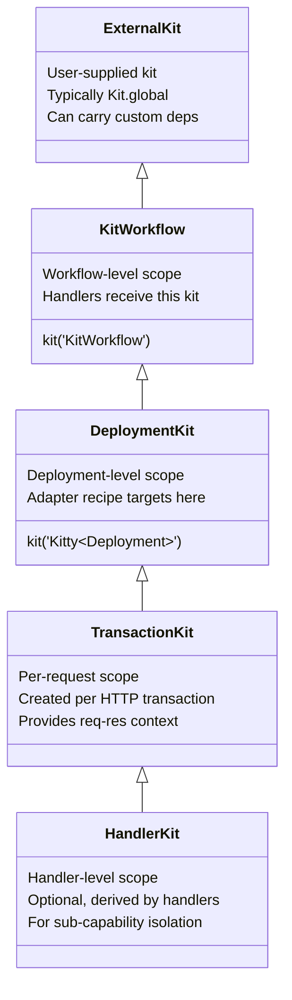

# KittyWorkflow Design Conventions

## Philosophy

Kitty shares a similar core design with Koa — middleware pipeline
orchestration — but targets more complex layering and division of
labor.

In Koa, every new capability is abstracted as middleware, yet some
high-frequency features remain hardcoded (e.g. response body detection
and content negotiation). These work well for common scenarios, but
become constraining when the pipeline needs to diverge — WebSocket
passthrough, custom upload handling, or protocol-specific
optimisations. There is no clean way to strip unwanted built-in
behaviour.

Kitty addresses this by treating features as **composable building
blocks**: capabilities are added to the pipeline in an orderly,
predictable, and observable way. Nothing is hardcoded — every feature
must be explicitly composed, and every layer has a well-defined
boundary (Kit → Workflow → Deployment → Transaction). This makes the
system adaptable to scenarios Koa's monolithic middleware model
handles poorly, while keeping the core simple and the extension path
clear.

`KittyWorkflow` is the central design object for orchestrating HTTP
server handlers under this philosophy.

## Lifecycle

```text
constructor(kit) → use(handler) → finalize()
  → deploy(server) / adapt(options)
  → (request) → TransactionKit
```

- **Construction**: Injects the `KitWorkflow` kit instance, freezes the
  object.
- **Orchestration**: Registers middleware handlers via `use()`,
  supports chaining.
- **Finalization**: `finalize()` composes the registered handler
  sequence into a single workflow. After this, `use()` is no longer
  allowed.
- **Deployment**:
  - `deploy(server)` — **auto-discovery path**: Pass an existing HTTP
    server instance. The matching adapter (constructor → installer
    mapping) is looked up from the global registry by traversing the
    server's prototype chain.
  - `adapt(options)()` — **ephemeral custom path**: Pass an options
    object (`constructor` + `install`) to get a `deployOnce`
    function, then invoke it immediately. No global registry
    registration occurs. Designed for one-off custom servers that
    cannot or should not be registered in the auto-discovery
    registry.

## Kit Hierarchy

When a `KittyWorkflow` is constructed, it derives a child kit from
the user-supplied kit to scope its own context. Deployment further
creates a deployment-level child kit. The inheritance chain:



- **External kit**: Passed to `constructor(kit)`. Defaults to
  `Kit.global`, but callers can supply a custom kit pre-loaded with
  specialized dependencies and services for the workflow's runtime
  environment.
- **`KitWorkflow`**: Derived from the external kit via
  `kit('KitWorkflow')`. This is the kit seen by workflow handlers.
  Its injector (`this[I_INJECTOR]`) is cached for internal use.
- **`Kitty<Deployment>`**: Derived from `KitWorkflow` at deploy time
  via `kit('Kitty<Deployment>')`. The adapter's recipe is bound to
  this kit — the adapter never touches the Workflow-level kit.
- **TransactionKit** (conceptual): Derived from `Kitty<Deployment>`
  per-request when a request arrives. Provides transaction-scoped
  context including request/response APIs (`Method`, `URL`, `Status`,
  `Request`, `Response`, etc.). Created and disposed per HTTP
  transaction.
- **HandlerKit** (conceptual, optional): Any handler inside the
  Transaction phase may further derive a child kit for sub-capability
  isolation. This is entirely at the handler's discretion — the
  framework does not mandate or limit the depth of derivation. This
  enables features to be composed as **building blocks** at the
  handler level, not just at the framework level.

## Plugin

A Plugin is a **capability installer** for a `KittyWorkflow` instance.
Unlike a Handler (which processes requests), a Plugin installs
dependencies onto various kit levels. It is the building block for
composing features in an orderly, predictable way.

### Plugin shape

```js
workflow.plugin({
  install:       Kit.defineRecipe(kit => { ... }),   // → KitWorkflow
  onDeploy:      Kit.defineRecipe(kit => { ... }),   // → DeploymentKit
  onTransaction: Kit.defineRecipe(kit => { ... }),   // → TransactionKit
});
```

All three hooks are optional Kit recipes. A plugin provides only the
hooks it needs.

### Design notes on kit layering

1. **No lazy installation**: Kit is designed as "not installed, not
   available". If a capability is needed, install it explicitly on the
   target kit layer. There is no lazy/proxy mechanism — the cost of
   `onTransaction` recipes is simply installing function references,
   not executing business logic.
2. **Asymmetric cross-layer access**: A child kit inherits capabilities
   from its parent (e.g. TransactionKit can access DeploymentKit's
   APIs), but a parent kit **cannot** reach into a child kit's context.
   This is a feature that enforces layer boundaries — DeploymentKit
   definitions cannot depend on TransactionKit-level data.
3. **Explicit composition**: Knowing a kit has a capability is
   sufficient to use it (`kit.get(...)`). No dynamic discovery or
   runtime injection is needed.

### Hook execution timing

| Hook            | Trigger                                | Target kit       | Purpose                                     |
| --------------- | -------------------------------------- | ---------------- | ------------------------------------------- |
| `install`       | `plugin()` called, before `finalize()` | `KitWorkflow`    | Workflow-level deps, register handlers      |
| `onDeploy`      | `deploy()` / `deployOnce()`            | `DeploymentKit`  | Extend adapter's low-level API              |
| `onTransaction` | Per HTTP request                       | `TransactionKit` | Per-request context (cookie, body, session) |

### Execution order at deploy

```text
1. Create DeploymentKit
2. Adapter.install → installs low-level protocol API
3. Plugin.onDeploy hooks → extend with higher-level capabilities
4. Start server
```

### Relationship with Adapter

Adapter provides the **low-level protocol API** on `DeploymentKit`
(e.g. raw header access, stream read/write). Plugin's `onDeploy` hook
builds higher-level abstractions on top (e.g. cookie parser wraps
header read/write, body parser wraps stream). Adapters stay lean;
plugins provide composable extensions.

### Relationship with `use()`

`use(handler)` is conceptually a lightweight anonymous plugin that
only provides an `onTransaction` hook:

```js
// These are equivalent:
workflow.use((kit, next) => { ... });
workflow.plugin({ onTransaction: Kit.defineRecipe(kit => { ... }) });
```

This keeps the model uniform — `use()` is just syntactic sugar for
the most common case.

## Performance Considerations

Kit was originally designed as a **cold-path facility assembly layer**
— a scaffolding for runtime bootstrapping that installs tooling
objects once or a few times during startup. After startup, those
objects are destructured into constants above hot business code and
cached. Since Kit property access was not on the hot path, JIT
optimisation was not a concern.

Kitty extends Kit's role into **hot-path (per-request) territory**
via `onTransaction` hooks.

### Actual cost model

Kit uses **Proxy + plain object** (`Object.create(null)`), not a Map:

- Property access (`kit.cookies`) goes through a Proxy `get` trap.
- On **happy path** (property found in local dependencies), the trap
  checks `property in dependencies` and returns immediately — a fast
  constant-time operation.
- On **miss** (property not local), it recurses up the parent chain
  via `parent[property]` — O(D) where D is the chain depth (typical
  4–5 layers; with nested containers up to 9–10).
- Property assignment (`kit.cookies = value`) goes through Proxy
  `set` trap — validates uniqueness and writes to the local
  dependencies object.

The cost of 20 `onTransaction` recipes (each with ~3 `kit.set()`
calls) plus handler-time property accesses via Proxy is estimated at
~20μs per request — negligible alongside typical I/O (5–100ms).

### JIT optimisation potential

Since dependencies are stored as **fixed named properties** on a
plain object (not Map entries), V8 can generate hidden classes. If
`onTransaction` recipes consistently set the same set of properties
in the same order across requests, the shape stabilises and Proxy
`get` can be JIT-optimised as monomorphic.

### Recommended access pattern

Direct `kit.property` access is available, but the recommended
pattern is using `Injector.bind(recipe)`:

```js
// Recommended: bound recipe receives kit as first arg
const handler = injector.bind((kit, args) => {
  // kit is pre-injected — no Proxy traversal needed at call site
});
```

`use` (bound recipe) ensures dependencies are explicit and correct,
especially when handlers are composed via `Composer.compose()` —
where the onion-shaped control flow reduces observability of
implicit kit lookups. The `touch` API exists but `use` is preferred
for production code.

### Mitigations in recipe design

- Keep `onTransaction` recipes lean: only install getters / method
  references, never pre-compute values.
- Minimise the number of `kit.set()` calls per recipe — batch related
  capabilities into fewer installs (namespace bundling).
- Limit N (total plugins with `onTransaction`) to a reasonable
  ceiling (typical production applications: 3–8).

### When it matters

For most real-world workloads (API servers, SSR, database-backed
apps), the handler's own I/O and business logic dominate the latency
budget — Kit's per-request overhead is negligible.

This becomes a genuine concern only in **ultra-low-latency hot paths**
such as reverse proxies, request routers, or transparent gateways
where handler logic itself is near-zero. For those scenarios,
avoiding `onTransaction` and accessing DeploymentKit-level utilities
directly from handlers is the recommended escape hatch.

### Mitigations in recipe packaging

A practical way to reduce `kit.set()` calls without changing the Kit
API is **namespace bundling**: group related capabilities under a
single key rather than installing them individually.

```js
// Instead of:
kit.set('cookies', cookies);
kit.set('session', session);
kit.set('body', bodyParser);

// Bundle under a namespace:
kit.set('http', { cookies, session, bodyParser });
// Or: kit.set('@cookie', { parse, serialize });
```

Benefits:

- **Fewer `kit.set()` calls** — each recipe installs 2–3 namespaces
  instead of 10+ individual entries, reducing hidden class transitions
  on the Kit store.
- **Cleaner Kit surface** — consumers find related capabilities under
  a predictable key instead of scanning flat keys.
- **Reusability** — a namespace bundle can be shared across recipes
  and layers.

The per-request overhead of 20 `onTransaction` recipes is estimated
at ~20μs. Compared against typical handler I/O (5–100ms), this is
<0.5% of total latency — acceptable for the vast majority of use
cases.

### Value proposition

Even with the per-request overhead, Kit's scope chain provides
significant advantages that justify the cost:

- **Predictable capability visibility**: A handler receives exactly
  the kit its layer provides — no surprise prototypes or implicit
  globals.
- **Defence in depth**: Capabilities must be explicitly installed
  before use. "Not installed, not available" prevents accidental
  leakage of cross-layer state.
- **Readability**: The scope chain makes it clear where each
  capability comes from — `kit.get('http')` vs `this.something` on a
  flat context.
- **Adaptive composition**: Adding or removing a plugin changes the
  capability set uniformly across all handlers in the workflow,
  without touching handler code.

These properties make the O(N) per-request installation a worthwhile
tradeoff for codebases that value predictability and composability
over raw throughput.

## Governance

- `plugin()` must be called before `finalize()`. After finalization,
  no more plugins can be added.
- Plugins are installed **immediately** at `plugin()` call time (for
  `install` hook). No deferral queue.
- Plugin dependency negotiation is the plugins' own responsibility —
  the framework does not define or enforce dependency ordering.

## Design Constraints

### 1. Immutability & Freezing

- `Object.freeze(this)` is called immediately after construction —
  instance properties are immutable.
- After `finalize()`, the handler sequence is `Object.freeze()`'d — no
  more handlers can be added.

### 2. State Guards

- `isFinal` guard: `finalize()` / `deploy()` / `adapt()` all check
  whether the workflow has already been finalized. Repeated calls
  throw.
- The `deployOnce` function returned by `adapt()` **must be called
  synchronously and exactly once**, enforced via `queueMicrotask`.
  Rationale: since `deployOnce` bypasses the global Adapter registry
  and couples directly to a custom installer, it must be consumed
  immediately at the call site — deferring or storing it risks
  inconsistent or orphaned state:

  ```js
  let deployed = false,
    available = true;
  queueMicrotask(() => (available = false));

  return function deployOnce(server, options) {
    if (!available) {
      /* not called immediately */
    }
    if (deployed) {
      /* already deployed */
    }
    deployed = true;
    // ...validation, deployment...
  };
  ```

  - `available` uses the microtask queue to guard the synchronous call
    window: calling within the same tick passes, calling later is
    rejected.
  - `deployed` is set before validation completes, ensuring only the
    first call proceeds past the guard.

### 3. Handler Signature

Handlers registered via `use()` must be functions with an arity of 2
or less:

```js
handler: ([kit[, next]]) => any
```

- Handlers with `length > 2` are rejected.

### 4. Deployment Paths

Two deployment paths serve different scenarios:

- **Discovery**
  - `deploy()`: Reverse lookup via Adapter registry (`Adapter.getByServer`).
  - `adapt()()`: Explicit `options.constructor`, checked via `instanceof`.
- **Registry**
  - `deploy()`: Relies on global registry of constructor → installer
    mappings, pre-populated by Kitty official adapters.
  - `adapt()()`: No global registration — ephemeral, one-off usage.
- **Use case**
  - `deploy()`: Standard server instances where the matching adapter is already
    registered.
  - `adapt()()`: Custom server variants not covered by official adapters, or when
    the user does not want to pollute the auto-discovery registry (e.g. a
    constructor slot is already occupied and cannot be overridden).
- **Reusability**
  - `deploy()`: Unlimited — can be called multiple times with different servers.
  - `adapt()()`: Once only — `deployOnce` rejects repeated calls.
- **Timing**
  - `deploy()`: No constraint.
  - `adapt()()`: Must be called synchronously within the same tick as `adapt()`.

### 5. Deployment Injection

Each adapter defines an `install` via `Kit.defineRecipe()` — a **Kit
recipe** that installs dependencies onto the deployment-level kit
(`Kitty<Deployment>`). The adapter concerns itself only with this
kit; it has no access to or effect on the Workflow-level kit
(`KitWorkflow`).

Deployment executes via
`Kit.Injector(kit).bind(install)(server, options)`, which binds the
recipe to the deployment kit and invokes it with `(server, options)`.

The `install` source varies by path:

- `deploy()`: fetched from the global Adapter registry.
- `adapt()`: provided directly in the `options` argument.

The internal `deploy` function is module-private and not exposed
externally.

## Glossary

- **Workflow**: The composed handler pipeline, produced by
  `Composer.compose()`.
- **Adapter**: A mapping between a server constructor and its
  installer. Works only on the deployment-level kit
  (`Kitty<Deployment>`); has no effect on the Workflow-level kit.
- **Kit Recipe**: Describes dependencies to install into a kit.
  Adapter `install` is a recipe defined via `Kit.defineRecipe()`.
- **deploy**: Auto-discovery deployment — looks up installer from
  global Adapter registry by prototype chain.
- **adapt**: Ephemeral custom deployment — no global registration,
  one-off use with immediate invocation guard.|
