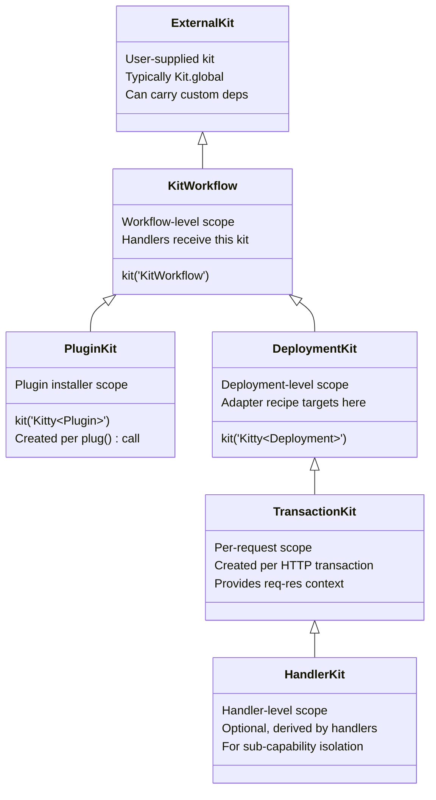

# KittyWorkflow Design Conventions

## Philosophy

Kitty shares a similar core design with Koa — middleware pipeline
orchestration — but targets more complex layering and division of
labor.

In Koa, every new capability is abstracted as middleware, yet some
high-frequency features remain hardcoded (e.g. response body detection
and content negotiation). These work well for common scenarios, but
become constraining when the pipeline needs to diverge — WebSocket
passthrough, custom upload handling, or protocol-specific
optimisations. There is no clean way to strip unwanted built-in
behaviour.

Kitty addresses this by treating features as **composable building
blocks**: capabilities are added to the pipeline in an orderly,
predictable, and observable way. Nothing is hardcoded — every feature
must be explicitly composed, and every layer has a well-defined
boundary (Kit → Workflow → Deployment → Transaction). This makes the
system adaptable to scenarios Koa's monolithic middleware model
handles poorly, while keeping the core simple and the extension path
clear.

`KittyWorkflow` is the central design object for orchestrating HTTP
server handlers under this philosophy.

## Lifecycle

```text
constructor(kit) → use(handler) → finalize()
  → deploy(server) / adapt(options)
  → (request) → TransactionKit
```

- **Construction**: Injects the `KitWorkflow` kit instance, freezes the
  object.
- **Orchestration**: Registers middleware handlers via `use()`,
  supports chaining.
- **Finalization**: `finalize()` composes the registered handler
  sequence into a single workflow. After this, `use()` is no longer
  allowed.
- **Deployment**:
  - `deploy(server)` — **auto-discovery path**: Pass an existing HTTP
    server instance. The matching adapter (constructor → installer
    mapping) is looked up from the global registry by traversing the
    server's prototype chain.
  - `adapt(options)()` — **ephemeral custom path**: Pass an options
    object (`constructor` + `install`) to get a `deployOnce`
    function, then invoke it immediately. No global registry
    registration occurs. Designed for one-off custom servers that
    cannot or should not be registered in the auto-discovery
    registry.
- **Return value**: Both `deploy()` and `adapt()()` resolve to the
  `server` instance itself. No management object is returned — the
  server's lifecycle is wholly owned by the caller (see [Server
  Lifecycle Ownership](#server-lifecycle-ownership)).

## Kit Hierarchy

When a `KittyWorkflow` is constructed, it derives a child kit from
the user-supplied kit to scope its own context. Deployment further
creates a deployment-level child kit. The inheritance chain:



- **External kit**: Passed to `constructor(kit)`. Defaults to
  `Kit.global`, but callers can supply a custom kit pre-loaded with
  specialized dependencies and services for the workflow's runtime
  environment.
- **`KitWorkflow`**: Derived from the external kit via
  `kit('KitWorkflow')`. This is the kit seen by workflow handlers.
  Its injector (`this[I_INJECTOR]`) is cached for internal use.
- **`Kitty<Plugin>`** (PluginKit): Derived from `KitWorkflow` per
  `plug()` call via `kit('Kitty<Plugin>')`. Passed to the installer
  function, it carries `appendPrefixHandler`, `setWorkflowKit`, and
  `appendDeploymentKitModifier` as its plugin authoring API.
- **`Kitty<Deployment>`**: Derived from `KitWorkflow` at deploy time
  via `kit('Kitty<Deployment>')`. The adapter's recipe is bound to
  this kit — the adapter never touches the Workflow-level kit.
- **TransactionKit** (conceptual): Derived from `Kitty<Deployment>`
  per-request when a request arrives. Provides transaction-scoped
  context including request/response APIs (`Method`, `URL`, `Status`,
  `Request`, `Response`, etc.). Created and disposed per HTTP
  transaction.
- **HandlerKit** (conceptual, optional): Any handler inside the
  Transaction phase may further derive a child kit for sub-capability
  isolation. This is entirely at the handler's discretion — the
  framework does not mandate or limit the depth of derivation. This
  enables features to be composed as **building blocks** at the
  handler level, not just at the framework level.

## Plugin

A Plugin is a **capability installer** for a `KittyWorkflow` instance.
Unlike a Handler (which processes requests), a Plugin installs
dependencies onto kit layers and registers handlers.

### Plugin shape

A plugin is defined as an **installer function** — a single entry
point that receives a `PluginKit` derived from `KitWorkflow`:

```js
workflow.plug((pluginKit) => {
  pluginKit.appendPrefixHandler((kit, next) => {
    /* runs before main sequence */
  });
  pluginKit.setWorkflowKit('myDep', someValue); // install on KitWorkflow
  pluginKit.appendDeploymentKitModifier((kit) => {
    /* modify DeploymentKit */
  });
});
```

The installer runs in a **coherent scope**: all side effects happen
within the installer call, making the plugin's intent explicit and
local.

### PluginKit API

`PluginKit` is a `KitProxy` derived from `KitWorkflow` via
`kit('Kitty<Plugin>')`, with three methods set via Proxy `set` trap:

| Method                                      | Behavior                                                      |
| ------------------------------------------- | ------------------------------------------------------------- |
| `pluginKit.appendPrefixHandler(...handler)` | Registers handler(s) into the prefix handler sequence         |
| `pluginKit.setWorkflowKit(key, value)`      | Sets a dependency on `KitWorkflow`                            |
| `pluginKit.appendDeploymentKitModifier(fn)` | Registers a modifier to run at deploy time on `DeploymentKit` |

`appendPrefixHandler(...handler)` validates each handler the same way
as `workflow.use()` and appends it to `I_HANDLER_PREFIX_SEQUENSE`.
Prefix handlers are composed **before** the main handler sequence in
`finalize()`, enabling plugins to inject behavior that wraps or guards
the entire pipeline.

`setWorkflowKit(key, value)` sets a dependency directly on the
`KitWorkflow` kit. Since all downstream kits (`DeploymentKit`,
`TransactionKit`) inherit from `KitWorkflow`, the value becomes
available to all handler layers.

`appendDeploymentKitModifier(modifier)` stores a callback to be
invoked during `deploy()` / `adapt()()` after the adapter has
installed its low-level protocol API on `DeploymentKit`. Each
modifier receives the `DeploymentKit` and can extend it with
higher-level capabilities (e.g. body parsing, cookie handling).

### Execution order at deploy

```text
1. Create DeploymentKit
2. Adapter.install → installs low-level protocol API
3. Plugin onDeploy hooks → extend with higher-level capabilities
4. Start server
```

### Relationship with Adapter

Adapter provides the **low-level protocol API** on `DeploymentKit`
(e.g. raw header access, stream read/write). Plugin's `onDeploy` hook
builds higher-level abstractions on top (e.g. cookie parser wraps
header read/write, body parser wraps stream). Adapters stay lean;
plugins provide composable extensions.

### Relationship with `use()`

`use(handler)` adds handlers to the **main handler sequence**, while
`pluginKit.appendPrefixHandler(handler)` adds them to the **prefix
handler sequence**. Both sequences are composed together at
`finalize()` — prefix first, then main:

```js
// Main sequence — registered by workflow.use():
workflow.use((kit, next) => { ... });

// Prefix sequence — registered by plugin:
workflow.plug((pluginKit) => {
  pluginKit.appendPrefixHandler((kit, next) => { ... });
});
```

Prefix handlers run before main handlers in the composed pipeline.
`use()` is the primary API for handler registration; `plug()` with
`appendPrefixHandler` is the plugin equivalent that also provides
`setWorkflowKit` and `appendDeploymentKitModifier` for broader
capability installation.

### Design notes on kit layering

1. **No lazy installation**: Kit is designed as "not installed, not
   available". If a capability is needed, install it explicitly on the
   target kit layer. There is no lazy/proxy mechanism — the cost of
   `onDeploy` recipes is simply installing function references,
   not executing business logic.
2. **Asymmetric cross-layer access**: A child kit inherits capabilities
   from its parent (e.g. TransactionKit can access DeploymentKit's
   APIs), but a parent kit **cannot** reach into a child kit's context.
   This is a feature that enforces layer boundaries — DeploymentKit
   definitions cannot depend on TransactionKit-level data.
3. **Explicit composition**: Knowing a kit has a capability is
   sufficient to use it (`kit[key]`). No dynamic discovery or
   runtime injection is needed.

## Typed Capability Accessors

Kit provides `Getter`, a small utility that wraps a property lookup
into a typed accessor function:

```js
import { Getter } from '@produck/kit';

// Returns { use: fn, touch: fn }
const { use, touch } = Getter('body');
```

### Recommended export pattern

Each plugin or adapter package exports its Getter with a semantic
name, controlling the strictness its consumers experience:

```js
// packages/kitty-body/src/accessors.mjs
import { Getter } from '@produck/kit';

// Only export `use` — consumers must ensure the capability is
// installed, or get an immediate ReferenceError at runtime.
export const { use: useBody } = Getter('body');
export const { use: useJson } = Getter('body:json');

// packages/kitty-cookie/src/accessors.mjs
import { Getter } from '@produck/kit';

export const { use: useCookie } = Getter('cookie');
```

### Symbol keys

Kit accepts `Symbol` as a property key, which brings additional
benefits over plain strings when used for internal capability keys:

```js
// Internal symbol — not exported
const K_COOKIE = Symbol('cookie');

// Plugin installs under the symbol
kit[K_COOKIE] = { parse, serialize };

// Getter wraps the symbol
export const { use: useCookie } = Getter(K_COOKIE);
```

Advantages of Symbol keys:

- **Collision-free**: Two plugins can never accidentally use the same
  key name, even if they coincidentally choose the same description.
- **Consumer-proof**: Consumers cannot construct the Symbol from
  outside the module — they **must** use the exported accessor. This
  prevents bypass patterns like `kit['cookie']` and ensures all
  capability access goes through the intended typed accessor.
- **Debugging aid**: The Symbol's description (`Symbol(cookie)`)
  appears in stack traces and error messages, giving readable hints
  without exposing the internal key as a magic string.

(The Kit Proxy already prevents capability discovery via enumeration
— `ownKeys` and `enumerate` traps are not provided. Consumers must
"know it's installed, so they can use it". Symbol keys reinforce this
contract at the module boundary.)

Consumer usage:

```js
import { useBody } from '@produck/kitty-body';
import { useCookie } from '@produck/kitty-cookie';

// TypeScript: body is inferred as Body — no `?` needed
// Runtime:   throws immediately if body plugin is missing
const body = useBody(kit);
const cookie = useCookie(kit);
```

### Strict vs tolerant access

|           | `use(kit)`                                           | `touch(kit)`                                              |
| --------- | ---------------------------------------------------- | --------------------------------------------------------- |
| Behaviour | Throws `ReferenceError` if key not found             | Returns `undefined` if key not found                      |
| Export    | Public, the primary API                              | Internal or unexported; if not exported, rots away via GC |
| Use case  | Production code, where missing deps should fail fast | Migration, optional features, probing                     |

The accessor author decides what to export. `touch` can be kept
internal for the plugin's own optional probing, while consumers only
see `use` — guaranteeing they either get the capability or fail
immediately.

### Comparison with Koa

|                     | Koa `ctx.body`                                           | Kitty `useBody(kit)`                                      |
| ------------------- | -------------------------------------------------------- | --------------------------------------------------------- |
| Type safety         | `ctx.body?` (may not exist, TS needs augmentation)       | `Body` (guaranteed, or throws)                            |
| Runtime feedback    | Silent `undefined`                                       | Immediate `ReferenceError` with kit chain trace           |
| Dependency tracking | Implicit — no way to know which middleware provides what | Explicit — import statement makes dependency visible      |
| Composability       | All middleware share one flat `ctx`                      | Each capability is a separate import, composed explicitly |

This pattern is the counterpart to `"not installed, not available"`:
consumers also declare their dependencies by importing the
corresponding accessor — making the capability graph visible in both
directions.

## Performance Considerations

Kit was originally designed as a **cold-path facility assembly layer**
— a scaffolding for runtime bootstrapping that installs tooling
objects once or a few times during startup. After startup, those
objects are destructured into constants above hot business code and
cached. Since Kit property access was not on the hot path, JIT
optimisation was not a concern.

Kitty extends Kit's role into **hot-path (per-request) territory**
via `onTransaction` hooks.

### Actual cost model

Kit uses **Proxy + plain object** (`Object.create(null)`), not a Map:

- Property access (`kit.cookies`) goes through a Proxy `get` trap.
- On **happy path** (property found in local dependencies), the trap
  checks `property in dependencies` and returns immediately — a fast
  constant-time operation.
- On **miss** (property not local), it recurses up the parent chain
  via `parent[property]` — O(D) where D is the chain depth (typical
  4–5 layers; with nested containers up to 9–10).
- Property assignment (`kit.cookies = value`) goes through Proxy
  `set` trap — validates uniqueness and writes to the local
  dependencies object.

The cost of 20 plugin `use()` handlers (each with ~3 `set()`
calls) plus handler-time property accesses via Proxy is estimated at
~20μs per request — negligible alongside typical I/O (5–100ms).

### JIT optimisation potential

Since dependencies are stored as **fixed named properties** on a
plain object (not Map entries), V8 can generate hidden classes. If
`onTransaction` recipes consistently set the same set of properties
in the same order across requests, the shape stabilises and Proxy
`get` can be JIT-optimised as monomorphic.

### Recommended access pattern

Direct `kit.property` access is available, but the recommended
pattern is using `Injector.bind(recipe)`:

```js
// Recommended: bound recipe receives kit as first arg
const handler = injector.bind((kit, args) => {
  // kit is pre-injected — no Proxy traversal needed at call site
});
```

`use` (bound recipe) ensures dependencies are explicit and correct,
especially when handlers are composed via `Composer.compose()` —
where the onion-shaped control flow reduces observability of
implicit kit lookups. The `touch` API exists but `use` is preferred
for production code.

### Mitigations in recipe design

- Keep `onTransaction` recipes lean: only install getters / method
  references, never pre-compute values.
- Minimise the number of `set()` calls per plugin — batch related
  capabilities into fewer installs (namespace bundling).
- Limit N (total plugins with `onTransaction`) to a reasonable
  ceiling (typical production applications: 3–8).

### When it matters

For most real-world workloads (API servers, SSR, database-backed
apps), the handler's own I/O and business logic dominate the latency
budget — Kit's per-request overhead is negligible.

This becomes a genuine concern only in **ultra-low-latency hot paths**
such as reverse proxies, request routers, or transparent gateways
where handler logic itself is near-zero. For those scenarios,
avoiding `onTransaction` and accessing DeploymentKit-level utilities
directly from handlers is the recommended escape hatch.

### Mitigations in recipe packaging

A practical way to reduce `set()` calls without changing the Kit
API is **namespace bundling**: group related capabilities under a
single key rather than installing them individually.

```js
// Instead of:
kit['cookies'] = cookies;
kit['session'] = session;
kit['body'] = bodyParser;

// Bundle under a namespace:
kit['http'] = { cookies, session, bodyParser };
// Or: kit['@cookie'] = { parse, serialize };
```

Benefits:

- **Fewer `set()` calls** — each plugin installs 2–3 namespaces
  instead of 10+ individual entries, reducing hidden class transitions
  on the Kit store.
- **Cleaner Kit surface** — consumers find related capabilities under
  a predictable key instead of scanning flat keys.
- **Reusability** — a namespace bundle can be shared across recipes
  and layers.

The per-request overhead of 20 `onTransaction` recipes is estimated
at ~20μs. Compared against typical handler I/O (5–100ms), this is
<0.5% of total latency — acceptable for the vast majority of use
cases.

### Value proposition

Even with the per-request overhead, Kit's scope chain provides
significant advantages that justify the cost:

- **Predictable capability visibility**: A handler receives exactly
  the kit its layer provides — no surprise prototypes or implicit
  globals.
- **Defence in depth**: Capabilities must be explicitly installed
  before use. "Not installed, not available" prevents accidental
  leakage of cross-layer state.
- **Readability**: The scope chain makes it clear where each
  capability comes from — `kit['http']` vs `this.something` on a
  flat context.
- **Adaptive composition**: Adding or removing a plugin changes the
  capability set uniformly across all handlers in the workflow,
  without touching handler code.

These properties make the O(N) per-request installation a worthwhile
tradeoff for codebases that value predictability and composability
over raw throughput.

## Governance

- `plugin()` must be called before `finalize()`. After finalization,
  no more plugins can be added.
- Plugins are installed **immediately** at `plugin()` call time (for
  `install` hook). No deferral queue.
- Plugin dependency negotiation is the plugins' own responsibility —
  the framework does not define or enforce dependency ordering.

## Adapter/Workflow Bridge Protocol

The `handleTransaction` function in `Deployment.mjs` is the sole bridge
between the Adapter layer (protocol-specific, knows server type) and
the Workflow layer (application logic, server-agnostic).

### Contract

```text
Adapter recipe: (DeploymentKit, [handle]) => void
handle:         (TransactionKit) => Promise<unknown>
```

- **Adapter recipe** receives `DeploymentKit` and a `handle` callback.
  It must:
  1. Extract the server from `DeploymentKit` via `useDeployment(kit)`.
  2. Attach protocol-specific listeners to the server
     (`server.on('request', ...)`, `server.on('stream', ...)`, etc.).
  3. On each incoming transaction, derive a `TransactionKit` from
     `DeploymentKit` and invoke `handle(TransactionKit)`.
- **handle** receives a `TransactionKit` and executes the workflow
  middleware pipeline against it. The Adapter awaits or ignores the
  returned promise depending on protocol semantics (HTTP/1.x typically
  awaits the response; HTTP/2 may handle concurrent streams).

### Protocol invariant

The Adapter **must not** assume anything about the Workflow layer:

- It does not know what handlers are registered via `use()`.
- It does not know what plugins are installed.
- It does not interact with the `KitWorkflow` kit — only with
  `DeploymentKit` and `TransactionKit`.

The Workflow layer **must not** assume anything about the transport:

- It does not know whether the server is HTTP/1.1, HTTP/2, or a custom
  protocol.
- It does not know the server's event model.
- It interacts only with capabilities installed on its kit.

### Motivation

Different server types expose fundamentally different event models:

| Server type    | Key events                            |
| -------------- | ------------------------------------- |
| `http.Server`  | `request`, `upgrade`, `checkContinue` |
| `http2.Server` | `session`, `stream`, `goaway`         |
| `net.Server`   | `connection`, `close`                 |

A unified lifecycle management object at the Workflow level would
either need to abstract all these into a lowest-common-denominator
interface (losing type-specific capabilities) or leak server-type
knowledge into Workflow. The Bridge Protocol avoids both by keeping
the Adapter as the sole owner of protocol semantics.

### Deployment flow

```text
deploy(server) / deployOnce(server)
  │
  ├─ 1. Create DeploymentKit from KitWorkflow
  ├─ 2. Store { server, options } on DeploymentKit (Symbol-keyed)
  ├─ 3. Injector.bind(listeners)(handleTransaction)
  │       │
  │       └─ listeners recipe executes:
  │            • Reads server via useDeployment(DeploymentKit)
  │            • Installs Transaction dependencies
  │            • Returns listeners map
  │              (e.g. { request: (req, res) => {}, upgrade: ... })
  │
  ├─ 4. install(server, listeners)
  │       │
  │       └─ Attaches each listener to server:
  │          for (const [event, handler] of Object.entries(listeners))
  │            server.on(event, handler)
  │
  └─ 5. Returns server (not a management wrapper)
```

This flow is identical for both `deploy()` and `adapt()` — the only
difference is how the `listeners` recipe is sourced (global registry
vs. inline options).

### Protocol correctness is the Adapter author's responsibility

The Bridge Protocol is a **documented contract**, not a machine-enforced
constraint. Workflow cannot verify at definition time that an Adapter
recipe calls `handle` in the right place, or calls it at all — that is
a runtime behaviour that only emerges when the server processes actual
requests.

Workflow does not provide test helpers for this verification. The
Adapter author chooses their own method to prove correctness (unit
tests, integration tests, manual verification, etc.). This is
consistent with the project's MIT licensing philosophy — the framework
defines the protocol; adapter authors are responsible for their own
implementations.

Downstream consumers (application developers) select an Adapter based
on trust or demonstrated quality. If an Adapter fails to call `handle`,
the symptom is clear at runtime (requests hang or error), and the
consumer can switch to a different Adapter.

### Transaction Template

A Transaction Template defines the standard capability set that every
`TransactionKit` must provide (e.g. `Method`, `URL`, `Status`,
`Request`, `Response` — the protocol-agnostic request/response
abstractions analogous to Koa's `ctx`).

**Design decision**: The Transaction Template lives in the `workflow`
core package, not as an independent sub-package.

Rationale:

1. **Core contract, not optional plugin**: The Transaction Template is
   part of the communication protocol between Workflow and Adapter —
   every Adapter must provide a `TransactionKit` that satisfies it.
   Making it independent would require every Adapter author to
   manually import and compose it, adding friction with no benefit.

2. **Implicit registration via import side effect**: Adapters register
   themselves into the global Adapter registry as a side effect of
   being imported. Since the Transaction Template is in the same core
   package, downstream users get both in one import — no separate
   registration step:

   ```js
   import '@produck/kitty-adapt-http';
   // Adapter registered, Transaction Template available — done.
   ```

3. **Workflow guarantees template installation**: `[I_DEPLOY]`
   composes the Transaction Template installer with the Adapter's
   own installer, ensuring the template is always present on every
   `TransactionKit` without the Adapter author needing to know about
   it:

   ```js
   async [I_DEPLOY](install, server, options) {
     const runtime = Kit.compose(
       TransactionTemplateInstaller,  // workflow core
       install,                       // adapter-specific
     );
     // ...
   }
   ```

   The Adapter only needs to provide protocol-specific capabilities
   (raw `req`/`res` objects, socket handles, etc.). The standard
   request/response abstractions are automatically in place.

This keeps the Adapter author's surface area minimal while ensuring
consistency across all Adapters.

### Body scope

Kitty core is responsible for memory safety. The first-class body
interface is always stream-based:

```js
tx.response.body.data; // Readable | null
tx.request.body.data; // Readable | null
```

- **Readable**: Always stream. Never auto-drains to Buffer. Consumers
  pipe or read chunks as needed.
- **null**: No body.

Core provides a default caching strategy (threshold → temp file) with
a policy controller installed on `DeploymentKit`:

```js
// Deploy-time configuration
workflow.deploy(server, {
  body: { threshold: '10MB', dir: '/tmp/kitty' },
});

// Handler can adjust per-request via inherited policy
workflow.use(async (kit, next) => {
  const policy = kit['body.policy'];
  policy.threshold = '500MB'; // this request allows larger body
  return next();
});
```

The policy controller is accessible from `TransactionKit` via kit
inheritance — no extra installation needed. This keeps the default
safe while allowing handlers to opt into different behavior.

This illustrates a broader design advantage: in traditional frameworks
(cache size, body limit, timeouts) are usually locked at middleware
initialization time. Changing them per-request requires awkward
workarounds or global state mutation. Kitty's `DeploymentKit` →
`TransactionKit` inheritance chain makes per-request policy
adjustment a natural pattern — the controller is installed once and
inherited by every request, and handlers can tune it without
affecting others.

Buffer-style convenience (`body.json()`, `body.text()`, etc.) is a
**plugin-level** concern built on top of the stream interface.

After `transaction.isFinished` is true, `response.body.data` setter
must reject further writes. This guard belongs in the Transaction
Template layer.

## Server Lifecycle Ownership

The server passed to `deploy()` / `deployOnce()` remains under the
caller's control at all times. Workflow does not:

- Start or stop the server.
- Track active connections or transactions.
- Expose a management handle for lifecycle operations.

### Rationale

1. **Server is caller-owned**: The caller constructed or acquired the
   server before passing it in. It can (and should) manage
   `server.listen()`, `server.close()`, error handling, and address
   queries directly.

2. **Protocol diversity**: Different server types have different
   lifecycle semantics (e.g., HTTP/2 has session lifecycle, HTTP/1.1
   has keep-alive). A Workflow-level abstraction would either be too
   thin to be useful or too leaky to be clean.

3. **Separation of concerns**: "How to close a server" is an Adapter
   concern; "what to do with each request" is a Workflow concern.
   Mixing them in a single return value conflates the two layers.

### What the caller controls

```js
const server = http.createServer();
const app = new Kitty.Workflow(kit);

app.finalize();
await app.deploy(server); // attaches middleware, does NOT listen
server.listen(3000); // caller starts accepting

// Later:
server.close(); // caller stops accepting
```

### Graceful shutdown

Since Workflow does not track active transactions, a graceful shutdown
requires the caller to coordinate at the server level:

```js
server.close(async () => {
  // All connections drained.
  // Workflow handlers are no longer invoked.
});
```

For more sophisticated draining (e.g., waiting for in-flight
TransactionKit promises), the Adapter recipe can expose a drain
capability on `DeploymentKit`:

```js
// Adapter recipe:
kit['drain'] = async () => {
  // Wait for all tracked TransactionKit promises
  await Promise.all(activeTransactions);
});
```

This stays at the Adapter level — Workflow never needs to know about
it.

## Event & Cross-Cutting Concerns

Kitty does not provide a built-in event bus, pub/sub mechanism, or
application-level hook system. These are **user-managed
cross-cutting concerns** placed in the ExternalKit.

### Pattern

1. **User** constructs an ExternalKit with the desired event/capability
   infrastructure:

   ```js
   import { EventEmitter } from 'node:events';
   import * as Kit from '@produck/kit';

   const EVENT_BUS = Symbol('app.eventBus');
   const kit = Kit.derive(Kit.global, (parent) => {
     parent[EVENT_BUS] = new EventEmitter();
   });
   ```

2. **User** passes it to `KittyWorkflow`:

   ```js
   const app = new Kitty.Workflow(kit);
   ```

3. **External code** subscribes via the same kit:

   ```js
   kit[EVENT_BUS].on('user.login', data => { ... });
   ```

4. **Business handler** accesses the bus via the kit inheritance chain
   (ExternalKit → KitWorkflow → DeploymentKit → TransactionKit):

   ```js
   // Inside a handler registered via use():
   function handler(TransactionKit, next) {
     TransactionKit[EVENT_BUS].emit('user.login', { userId });
     return next();
   }
   ```

### Why not built-in

- **Type diversity**: Users may want `EventEmitter`, `EventTarget`,
  Redis pub/sub, or a custom message bus. Workflow should not mandate
  one.
- **Zero-dependency principle**: Adding built-in events would make
  Kitty depend on `node:events` even for users who do not need events.
- **Kit is already the extension channel**: The ExternalKit user
  provides at construction time serves as the natural carrier for
  cross-cutting concerns. No additional framework concepts needed.
- **Consistency**: If events are just another kit capability, they
  follow the same "not installed, not available" contract as
  everything else — no special treatment.

### What this means for handleTransaction

The `handleTransaction` bridge does not need to wire up events.
Events flow through the kit chain automatically: anything installed
on ExternalKit is reachable from TransactionKit. The Adapter recipe
does not need to propagate events — it only creates the
TransactionKit, and kit inheritance does the rest.

## Design Constraints

### 1. Immutability & Freezing

- `Object.freeze(this)` is called immediately after construction —
  instance properties are immutable.
- After `finalize()`, the handler sequence is `Object.freeze()`'d — no
  more handlers can be added.

### 2. State Guards

- `isFinal` guard: `finalize()` / `deploy()` / `adapt()` all check
  whether the workflow has already been finalized. Repeated calls
  throw.
- The `deployOnce` function returned by `adapt()` **must be called
  synchronously and exactly once**, enforced via `queueMicrotask`.
  Rationale: since `deployOnce` bypasses the global Adapter registry
  and couples directly to a custom installer, it must be consumed
  immediately at the call site — deferring or storing it risks
  inconsistent or orphaned state:

  ```js
  let deployed = false,
    available = true;
  queueMicrotask(() => (available = false));

  return function deployOnce(server, options) {
    if (!available) {
      /* not called immediately */
    }
    if (deployed) {
      /* already deployed */
    }
    deployed = true;
    // ...validation, deployment...
  };
  ```

  - `available` uses the microtask queue to guard the synchronous call
    window: calling within the same tick passes, calling later is
    rejected.
  - `deployed` is set before validation completes, ensuring only the
    first call proceeds past the guard.

### 3. Handler Signature

Handlers registered via `use()` must be functions with an arity of 2
or less:

```js
handler: ([kit[, next]]) => any
```

- Handlers with `length > 2` are rejected.

### 4. Deployment Paths

Two deployment paths serve different scenarios:

- **Discovery**
  - `deploy()`: Reverse lookup via Adapter registry (`Adapter.getByServer`).
  - `adapt()()`: Explicit `options.constructor`, checked via `instanceof`.
- **Registry**
  - `deploy()`: Relies on global registry of constructor → installer
    mappings, pre-populated by Kitty official adapters.
  - `adapt()()`: No global registration — ephemeral, one-off usage.
- **Use case**
  - `deploy()`: Standard server instances where the matching adapter is already
    registered.
  - `adapt()()`: Custom server variants not covered by official adapters, or when
    the user does not want to pollute the auto-discovery registry (e.g. a
    constructor slot is already occupied and cannot be overridden).
- **Reusability**
  - `deploy()`: Unlimited — can be called multiple times with different servers.
  - `adapt()()`: Once only — `deployOnce` rejects repeated calls.
- **Timing**
  - `deploy()`: No constraint.
  - `adapt()()`: Must be called synchronously within the same tick as `adapt()`.

### 5. Deployment Injection

Each adapter defines `listeners` via `Kit.defineRecipe()` — a **Kit
recipe** that installs dependencies onto the deployment-level kit
(`Kitty<Deployment>`) and returns a map of event handlers.

And an `install` — a plain function `(server, listeners) => void`
that attaches the listeners to a server instance. Unlike `listeners`,
`install` has no access to DeploymentKit.

The adapter concerns itself only with the deployment-level kit; it
has no access to or effect on the Workflow-level kit
(`KitWorkflow`).

Deployment executes via
`Kit.Injector(kit).bind(listeners)(handleTransaction)`, which binds
the recipe to the deployment kit and invokes it to produce the
listeners map, then passes it to `install(server, listeners)`.

The `listeners` source varies by path:

- `deploy()`: fetched from the global Adapter registry.
- `adapt()`: provided directly in the `options` argument.

The internal `deploy` function is module-private and not exposed
externally.

## Adapter listeners/install split

Split adapter `install` into two phases — `listeners` + `install` —
to support exporting raw listeners similar to Koa's
`app.callback()`.

### `listeners`

- Type: `Kit.defineRecipe((DeploymentKit, [handle]) => Record<string, Function>)`
- Responsibility: Install Transaction dependencies on the
  DeploymentKit and produce a map of event handlers
  (e.g. HTTP/1.x adapter produces
  `{ request: (req, res) => {}, upgrade: (req, socket, head) => {} }`;
  HTTP/2 adapter produces
  `{ stream: (stream, headers) => {}, request: (req, res) => {} }`).
- Side-effect-free. Can be called independently by `callback()`.

### `install`

- Type: `(server, listeners) => void`
- Responsibility: Attach the default event handlers to the server
  instance. Each adapter knows its own default — e.g. HTTP/2 adapter
  installs `stream` only, not `request`. The `request` handler is
  provided for users who prefer the compatibility shim.
- **Not a Kit recipe** — must not access DeploymentKit.
- Called by `deploy(server)` after the listeners phase.
- Since all Node.js server types inherit from `net.Server` (EventEmitter),
  the attachment interface is uniform across protocols.

### Flow

```text
callback(constructor) → listeners phase → returns listeners map
deploy(server)        → listeners phase → install(server, listeners)

// Basic user: default install strategy (e.g. http2 → stream)
workflow.deploy(server);

// Advanced user: selective listening via callback()
const listeners = workflow.callback(http2.Server);
http2.createServer(listeners.stream).listen(3000);
// or use the compatibility shim:
http2.createServer(listeners.request).listen(3000);
```

### Lookup by constructor

`callback(constructor)` looks up the registered adapter from the
global registry by constructor, without requiring a server instance.

> **TODO**: Registry currently stores `install` (recipe) and `name`.
> Need to confirm whether registry stores both `listeners` and
> `install` separately, or if the new adapter structure combines them.

### Benefits

- Users get raw listeners as flexible as Koa's `app.callback()`.
- `listeners` returns a map — one adapter can produce multiple event
  handlers (`request`, `upgrade`, `stream`, etc.) for different
  protocols.
- Plain function type for `install` naturally enforces that it
  must not modify DeploymentKit.
- Both `listeners` and `deploy` share the same listener output — no
  duplicated logic.

### Protocol resources on TransactionKit

The adapter owns the `stream` / `request` event and is responsible
for creating `TransactionKit` inside it. At that point it can install
protocol-specific resources directly onto `TransactionKit`:

```js
server.on('stream', (stream, headers) => {
  const TransactionKit = DeploymentKit('Kitty<Transaction>');
  kit[K_STREAM] = stream;
  kit[K_SESSION] = stream.session;
  // ... install Transaction Template, then handle
  handle(TransactionKit);
});
```

- `stream` gives access to stream-level features (trailers, push,
  reset).
- `stream.session` gives access to session-level features (settings,
  ping, goaway) — available without a separate `session` listener.
- Handlers import typed accessors (`useStream`, `useSession`) to
  consume these resources.

These protocol resources are **adapter-specific** and not part of the
core Transaction Template. They follow the same
"not installed, not available" contract as any other kit capability.

### Protocol-aware routing

Because all entry points (http1 request, http1 upgrade, http2 stream)
flow into the same workflow pipeline via `TransactionKit`, the
protocol becomes a dimension at the handler layer — not an
infrastructure concern.

```js
workflow.use((kit, next) => {
  const tx = useTransaction(kit);

  if (tx.protocol === 'ws') {
    return handleWebSocket(kit);
  }

  return next();
});
```

This is a novel capability — existing frameworks treat WebSocket and
other non-HTTP protocols as "exceptions" handled outside the
middleware pipeline. Kitty's `TransactionKit` unification makes
protocol a first-class routing dimension.

> **Note (external, to be moved out)**: The semantics of `protocol`
> and `method` may overlap in ambiguous ways — e.g. `POST` is a
> method, `ws` is a protocol upgrade, `sse` is content negotiation.
> A future router module must decide how to express these dimensions
> without conflating them. The core layer intentionally stays out of
> this decision.

## Glossary

- **Workflow**: The composed handler pipeline, produced by
  `Composer.compose()`.
- **Adapter**: A mapping between a server constructor and its
  installer. Works only on the deployment-level kit
  (`Kitty<Deployment>`); has no effect on the Workflow-level kit.
- **Kit Recipe**: Describes dependencies to install into a kit.
  Adapter `listeners` is a recipe defined via `Kit.defineRecipe()`.
- **listeners**: A Kit recipe that produces a protocol-specific
  map of event handlers (e.g. `{ request: (req, res) => {} }`).
- **install**: A plain function `(server, listener) => void` that
  attaches a listener to a server instance. Not a Kit recipe.
- **deploy**: Auto-discovery deployment — looks up installer from
  global Adapter registry by prototype chain.
- **adapt**: Ephemeral custom deployment — no global registration,
  one-off use with immediate invocation guard.|
