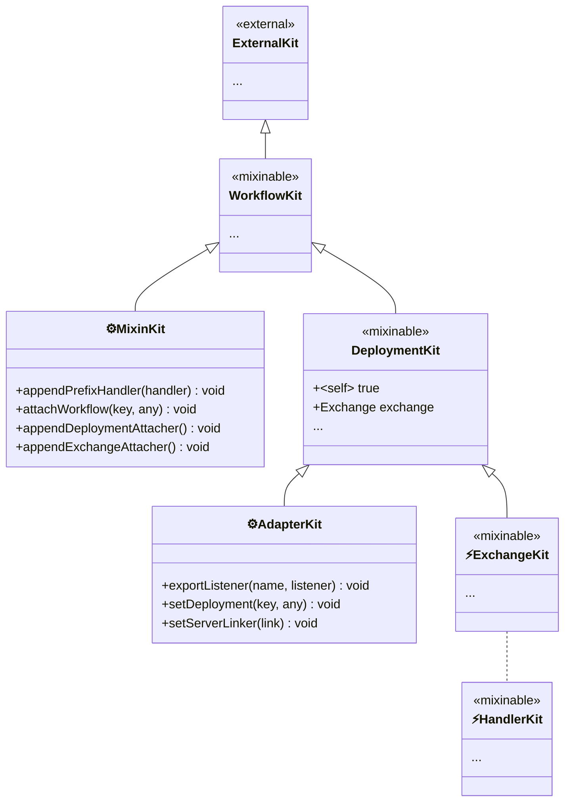

# KittyWorkflow Design Conventions

## Document Scope

DESIGN.md is the working draft for AI collaboration and exploration.
Stable conclusions should be moved into ARCHITECTURE.md.

Deployment paths are discussed in more detail in
[DEPLOYMENT.md](DEPLOYMENT.md).

Attachment ports are discussed in more detail in
[ATTACHMENT-PORTS.md](ATTACHMENT-PORTS.md).

## Terminology: Attachment

**Attachment** is a key term in KittyWorkflow. At the kit level, it
names the act of appending a dependency or capability to a `Kit`, which
acts as the domain tracker for that part of the assembled program.

In KittyWorkflow, attachment is narrowed into a controlled structural
write. An attachment may install a workflow-static dependency, register
a deployment attacher, or register an exchange attacher. The derived
term **attacher** means a function recorded by one domain and later run
to attach dependencies into another kit scope.

The important property in workflow assembly is control. Attachment is
not arbitrary mutation of `WorkflowKit`; it is a lifecycle-guarded
structural write performed through an authorized surface. In this
vocabulary, `MixinKit` and `AdapterKit` are attachment ports:
supplier-facing facades that expose specific attachment abilities
without exposing the full workflow authority behind them.

## Philosophy

Kitty shares a similar core design with Koa — middleware pipeline
orchestration — but targets more complex layering and division of
labor.

In Koa, every new capability is abstracted as middleware, yet some
high-frequency features remain hardcoded (e.g. response body detection
and content negotiation). These work well for common scenarios, but
become constraining when the pipeline needs to diverge — WebSocket
passthrough, custom upload handling, or protocol-specific
optimisations. There is no clean way to strip unwanted built-in
behaviour.

Kitty addresses this by treating features as **composable building
blocks**: capabilities are added to the pipeline in an orderly,
predictable, and observable way. Nothing is hardcoded — every feature
must be explicitly composed, and every layer has a well-defined
boundary (Kit → Workflow → Deployment → Exchange). This makes the
system adaptable to scenarios Koa's monolithic middleware model
handles poorly, while keeping the core simple and the extension path
clear.

`KittyWorkflow` is the central design object for orchestrating HTTP
server handlers under this philosophy.

## Kit As Scope Inheritance

`@produck/kit` is best understood here as a scope-inheritance mechanism
for program assembly. It models capability distribution as inheritance
between explicit runtime scopes, rather than as parameter passing,
global registries, or call-frame context.

The tracked unit is a structural scope, not a call frame. A frame may be
where a child kit is physically created, but the design intent is to
express where a capability belongs in the assembled program:

```text
WorkflowKit -> DeploymentKit -> ExchangeKit -> Handler child kits
```

This keeps the main composition question small: which scope should own
this capability? Once installed at the right scope, the capability is
distributed downward by normal kit inheritance and can be accessed with
ordinary property syntax.

`WorkflowKit` also carries the workflow instance itself as a stable
identity capability. Downstream code may read that identity via
`useWorkflow(kit)` and use it as a `WeakMap` key, but it does not receive
direct write access to `WorkflowKit`. Structural writes remain behind
guarded attachment-port methods.

Kitty is a concrete use of this mechanism. It does not try to model all
program effects as typed computations. Instead, it uses kit inheritance
to assemble workflow, deployment, adapter, exchange, and handler
capabilities at the layers where they belong.

## Core As Authority Boundary

> Kitty core is "dividing territory and assigning authority".

This is an intuitive way to describe the core responsibility. Kitty core
does not own downstream feature grammar, but it does own the authority
model: which runtime scopes exist, which attachment ports are issued,
which structural writes are allowed, and when those writes expire.

In engineering terms, core is responsible for:

- dividing the kit hierarchy into workflow, deployment, adapter,
  exchange, and handler scopes;
- owning the workflow assembly surface and granting attachment ports
  such as `MixinKit` and `AdapterKit` as facades to that surface;
- keeping structural writes behind guarded methods;
- defining lifecycle windows such as finalization, deployment artifact
  construction, and per-exchange runtime scope;
- exposing workflow identity without exposing the writable
  `WorkflowKit` surface.

Downstream suppliers own feature grammar and runtime policy. Handler
authors consume inherited capabilities. Core's job is to keep those
roles from accidentally receiving each other's authority.

### Workflow Assembly Surface

The stable source of structural attachment authority is the workflow
assembly surface. It is owned by `WorkflowKit`, not independently by each
supplier-facing kit.

The assembly surface consists of three controlled capability classes:

- **Workflow-static dependencies**: values installed directly on
  `WorkflowKit` and inherited by later deployment, exchange, and handler
  scopes.
- **Deployment attachers**: functions recorded on the workflow and run
  during compile-time `DeploymentKit` preparation, allowing suppliers to
  install deployment-scope capabilities before the adapter artifact is
  built.
- **Exchange attachers**: functions recorded on the workflow and run
  when an `ExchangeKit` is prepared, allowing suppliers to install
  per-exchange capabilities.

`MixinKit` and `AdapterKit` should be understood as supplier-facing
facades over this workflow-owned assembly surface. They may expose the
same controlled attachment abilities, but the authority and lifecycle
guard belong to the workflow. After `finalize()`, structural additions to
the assembly surface are closed.

## Architecture Overview

`KittyWorkflow` is split into two layers:

- **Abstract layer** (`Abstract.mjs`): Defines the lifecycle template
  — `constructor(kit)` → `use(handler)` → `finalize()` →
  `compile()`/`deploy()`. It exposes extension point hooks (`_I`
  namespace) for subclasses to fill in: compose extension, adapter
  compilation, and compile-time deployment preparation. It also installs
  the base `attachWorkflow` capability, because attaching to the
  Workflow scope belongs to the lifecycle skeleton itself. The abstract
  layer knows nothing about mixin, adapter registry, or temporary
  adapters — it is purely an extensible skeleton.

- **Composition layer** (`Compound.mjs`): Extends the abstract layer
  and implements two orthogonal domains — **Mixin** and **Adapter** —
  each responsible for a distinct kind of capability injection. The
  composition layer also owns `adapt(options)`, because temporary
  adapters only make sense after the Adapter domain has been introduced.
  It installs `appendDeploymentAttacher` and `appendExchangeAttacher`,
  because those attachment hooks are executed at Composition-owned
  deployment and exchange boundaries.
  `MixinKit` and `AdapterKit` act as attachment ports: scoped,
  kit-backed facades over the workflow assembly surface. They let
  downstream suppliers install and later adjust their own workflow
  features without receiving direct `WorkflowKit` authority. Retaining
  these ports is optional; suppliers may also treat them as one-shot
  installation arguments and discard them.

## Lifecycle (Abstract Layer)

```text
constructor(kit) → use(handler) → finalize()
  → deploy(server) / compile(server)
  → (request) → ExchangeKit
```

- **Construction**: Injects the `KitWorkflow` kit instance, freezes the
  object.
- **Orchestration**: Registers middleware handlers via `use()`,
  supports chaining. In the composition layer, `mixin(installer)` is
  also available before finalization to register mixin-based plugins.
- **Finalization**: `finalize()` composes the registered handler
  sequence into a single workflow. After this, `use()` and `mixin()`
  are no longer allowed.
- **Compile**:
  - `compile(server)` — **standalone listeners**:
    Produces the listener record from the registered adapter's
    deployment artifact without linking it to the server. The caller
    receives raw event handlers for custom wiring.
- **Deployment**:
  - `deploy(server)` — **auto-discovery path**: Pass an
    existing HTTP server instance suitable for the registered adapter.
    Looks up the standard adapter, compiles a deployment artifact, and
    calls its `link(server, listeners)` function.

### Composition Layer Extensions

`CompoundKittyWorkflow` overrides the abstract layer hooks to
introduce two domains:

- **Mixin domain**: Provides `mixin(installer)` API and manages
  prefix handler registration and deployment modifiers.
- **Adapter domain**: Provides server-type-aware compilation and
  linking via a registry of adapter definitions.
- **Ephemeral adapter path**: Provides `adapt(options)` as a
  Compound-layer deployment extension. It returns
  `{ compile, deploy }` for one-off adapters without global
  registration.

The full lifecycle in the composition layer becomes:

```text
constructor(kit) → mixin(installer)* → use(handler)* → finalize()
  → deploy(server) / compile(server) / adapt(options)
  → Adapter.Registry / temporary adapter → DeploymentKit prepared
  → (request) → ExchangeKit → Exchange created → workflow pipeline
```

## Kit Hierarchy

When a `KittyWorkflow` is constructed, it derives a child kit from
the user-supplied kit to scope its own context. Deployment further
creates a deployment-level child kit. The inheritance chain:



This diagram is also an authority boundary. Handler code travels through
the `ExchangeKit` branch and does not naturally receive `MixinKit` or
`AdapterKit`. Those kits are attachment ports managed by their suppliers.
If a supplier wants handler code to adjust a feature, it must explicitly
export an adjustment function that accepts workflow identity. Handler
code can read that identity with `useWorkflow(ExchangeKit)` and call the
supplier API; no additional kit-visible adjuster path is required.

The full hierarchy is a core-level view, not a required mental model for
every downstream role. Handler authors normally see only their current
kit and supplier-provided `use*()` functions. Mixin suppliers work with
`MixinKit` and guarded writes toward `WorkflowKit`. Adapter suppliers
work with `AdapterKit`, `DeploymentKit`, and `ExchangeKit` because they
own the protocol bridge. Each role only needs the part of the hierarchy
that it can actually use.

This is an intentional complexity tradeoff. Mixin and adapter suppliers
are expected to understand more of the authority model because they
define abstract capabilities for others. Handler authors are the primary
runtime consumers, so their surface should remain simple: current kit,
supplier-provided `use*()` helpers, and occasional supplier APIs that
accept workflow identity.

- **External kit**: Passed to `constructor(kit)`. Defaults to
  `Kit.global`, but callers can supply a custom kit pre-loaded with
  specialized dependencies and services for the workflow's runtime
  environment.
- **`KitWorkflow`**: Derived from the external kit via
  `kit('KitWorkflow')`. This is the kit seen by workflow handlers.
  Its injector (`this[I_INJECTOR]`) is cached for internal use.
- **`Kitty<Mixin>`** (MixinKit): Derived from `KitWorkflow` per
  `mixin()` call via `kit('Kitty<Mixin>')`. Passed to the installer
  function, it carries `appendPrefixHandler`, `attachWorkflow`,
  `appendDeploymentAttacher`, and `appendExchangeAttacher` as its mixin
  authoring API.
- **`Kitty<Deployment>`**: Derived from `KitWorkflow` at deploy time
  via `kit('Kitty<Deployment>')`. The adapter's recipe is bound to
  this kit — the adapter never touches the Workflow-level kit.
- **ExchangeKit**: Derived from
  `Kitty<Deployment>` per-request when a request arrives. Provides
  exchange-scoped context including request/response APIs (`Method`,
  `URL`, `Status`, `Request`, `Response`, etc.). Created and disposed
  per HTTP exchange. Unlike parent kits (created once at setup),
  ExchangeKit is **frequently created** — one per incoming request.
  The concrete implementation uses the `Exchange` abstraction
  (`Exchange/` directory) to decouple from server-specific protocols.
- **HandlerKit** ⚡ (conceptual, optional): Any handler inside the
  Exchange phase may further derive a child kit for sub-capability
  isolation. This is entirely at the handler's discretion — the
  framework does not mandate or limit the depth of derivation. This
  enables features to be composed as **building blocks** at the
  handler level, not just at the framework level. Created per-handler
  invocation when derived, so also **frequently created**.

  > HandlerKit is shown with a dotted line because it **may not exist**
  > at all — a handler that does not call `next(kit)` or derive a child
  > kit simply does not create this layer. The diagram includes it for
  > conceptual completeness, not as a mandatory scope.

## Mixin Domain

The Mixin domain is one of the two composition domains in
`CompoundKittyWorkflow`. It is responsible for **purely extending
high-level features** on top of the low-level Exchange abstraction
provided by the Adapter domain.

A Mixin is a **capability installer** for a `KittyWorkflow` instance.
Unlike a Handler (which processes requests), a Mixin installs
dependencies onto kit layers and registers handlers.

### Mixin shape

A mixin is defined as an **installer function** — a single entry
point that receives a `MixinKit` derived from `KitWorkflow`:

```js
workflow.mixin((mixinKit) => {
  mixinKit.appendPrefixHandler((kit, next) => {
    /* runs before main sequence */
  });
  mixinKit.attachWorkflow('myDep', someValue); // attach to Workflow scope
  mixinKit.appendDeploymentAttacher((kit) => {
    /* modify DeploymentKit */
  });
});
```

The installer runs in a **coherent scope**: all side effects happen
within the installer call, making the mixin's intent explicit and
local.

### MixinKit API

`MixinKit` is a `KitProxy` derived from `KitWorkflow` via
`kit('Kitty<Mixin>')`, with three methods set via Proxy `set` trap:

| Method                                     | Behavior                                              |
| ------------------------------------------ | ----------------------------------------------------- |
| `mixinKit.appendPrefixHandler(...handler)` | Registers handler(s) into the prefix handler sequence |
| `mixinKit.attachWorkflow(key, value)`      | Attaches a dependency to the Workflow scope           |
| `mixinKit.appendDeploymentAttacher(fn)`    | Registers an attacher to run against `DeploymentKit`  |
| `mixinKit.appendExchangeAttacher(fn)`      | Registers an attacher to run against `ExchangeKit`    |

`appendPrefixHandler(...handler)` validates each handler the same way
as `workflow.use()` and appends it to `I_HANDLER_PREFIX_SEQUENSE`.
Prefix handlers are composed **before** the main handler sequence in
`finalize()`, enabling plugins to inject behavior that wraps or guards
the entire pipeline.

`attachWorkflow(key, value)` attaches a dependency directly to the
Workflow scope. Since all downstream kits (`DeploymentKit`,
`ExchangeKit`) inherit from `KitWorkflow`, the value becomes
available to all handler layers.

`appendDeploymentAttacher(attacher)` stores a callback to be invoked
during `deploy()` / `adapt()` after the `DeploymentKit` has been
created. Each attacher receives the `DeploymentKit` and can extend it
with higher-level capabilities (e.g. body parsing, cookie handling).

`appendExchangeAttacher(attacher)` stores a callback to be invoked after
an `ExchangeKit` has been validated and before the workflow handler
pipeline runs. Each attacher receives the `ExchangeKit` and can extend
the per-exchange scope.

### Execution order at deploy

```text
1. Create DeploymentKit
2. Adapter.install → installs low-level protocol API (event wiring,
   Exchange creation per request)
3. Mixin deployment modifiers → extend DeploymentKit with
   higher-level capabilities (body parsing, cookie handling, etc.)
4. Start server
```

### Relationship with Adapter

Adapter provides the **low-level protocol API** on `DeploymentKit`
(e.g. Exchange creation, raw header access, stream read/write).
Mixin's deployment modifiers build higher-level abstractions on top
(e.g. cookie parser wraps header read/write, body parser wraps
stream). Adapters stay lean (per-server-type protocol bridging);
mixins provide composable high-level extensions.

### Relationship with `use()`

`use(handler)` adds handlers to the **main handler sequence**, while
`mixinKit.appendPrefixHandler(handler)` adds them to the **prefix
handler sequence**. Both sequences are composed together at
`finalize()` — prefix first, then main:

```js
// Main sequence — registered by workflow.use():
workflow.use((kit, next) => { ... });

// Prefix sequence — registered by mixin:
workflow.mixin((mixinKit) => {
  mixinKit.appendPrefixHandler((kit, next) => { ... });
});
```

**Why MixinKit does not provide a `use()` shortcut.** The onion model
dictates that abstract/infrastructure layers wrap concrete/business
layers. Mixins install infrastructure capabilities (body parsing,
cookie handling, session, auth) — these must always reside **outside**
the business pipeline. Allowing mixins to inject handlers into the
main sequence via `use()` would break the
"abstract-before-concrete" invariant, because a mixin's handler could
end up **after** a business handler depending on call order, creating
an invisible dependency inversion. By restricting mixins to
`appendPrefixHandler`, every reader knows at a glance: **everything
from a mixin runs before the main sequence** — no ordering guesswork.

If a user needs handlers from a specific mixin to run in a precise
position relative to business handlers, they already have a tool:
place `workflow.use(...)` immediately after the relevant
`workflow.mixin(...)` call. Mixin and `use` operate in separate
worlds — the sequence of `mixin()` and `use()` calls at call site is
the user's ordering mechanism, not a method on MixinKit.

`use()` is the primary API for handler registration; `mixin()` with
`appendPrefixHandler` is the mixin equivalent that also provides
`attachWorkflow` and `appendDeploymentAttacher` for broader
capability installation.

### Design notes on kit layering

1. **No lazy installation**: Kit is designed as "not installed, not
   available". If a capability is needed, install it explicitly on the
   target kit layer. There is no lazy/proxy mechanism — the cost of
   `onDeploy` recipes is simply installing function references,
   not executing business logic.
2. **Asymmetric cross-layer access**: A child kit inherits capabilities
   from its parent (e.g. ExchangeKit can access DeploymentKit's
   APIs), but a parent kit **cannot** reach into a child kit's context.
   This is a feature that enforces layer boundaries — DeploymentKit
   definitions cannot depend on ExchangeKit-level data.
3. **Explicit composition**: Knowing a kit has a capability is
   sufficient to use it (`kit[key]`). No dynamic discovery or
   runtime injection is needed.

## Adapter Domain

The Adapter domain is the second composition domain in
`CompoundKittyWorkflow`. It is responsible for **server-type-specific
protocol bridging** — translating the raw events of a particular
server implementation (node `http.Server`, `http2.Server`, etc.) into
the uniform `Exchange` abstraction consumed by the workflow pipeline.

### Adapter Registration

Adapters are registered globally via `Adapter.Registry.register(options)`:

```js
import * as http from 'node:http';
import * as Kitty from '@produck/kitty-workflow';

Kitty.Adapter.Registry.register({
  name: 'http.http11.nodejs',
  constructor: http.Server,
  install(AdapterKit) {
    AdapterKit.exportListener('request', (req, res) => {
      const ExchangeKit = AdapterKit('Kitty<Exchange>');
      // wire req/res into Exchange abstract interface
      AdapterKit.handleExchange(ExchangeKit);
    });

    AdapterKit.setServerLinker((server, listeners) => {
      server.on('request', listeners.request);
    });
  },
});
```

| Option        | Description                                        |
| ------------- | -------------------------------------------------- |
| `constructor` | Subclass of `net.Server` that this adapter targets |
| `name`        | Logical adapter identifier                         |
| `install`     | Function that installs deployment adapter behavior |

### Lookup

At deploy time, `CompoundKittyWorkflow` calls
`Adapter.Registry.getByServer(server)` to find the matching adapter
entry by walking the server's prototype chain against registered
constructors. The registry value is `{ name, install }`; `name` is the
logical adapter name and is distinct from the server constructor name.

### AdapterKit API

When an adapter's `install(AdapterKit)` function is invoked, it receives
an `AdapterKit` derived from `DeploymentKit` with the following API:

`AdapterKit` is a one-time isolation port. It keeps adapter authors
from mutating `DeploymentKit` directly while still allowing the adapter
to install deployment behavior: listeners, a server linker, and
deployment-scoped dependencies.

| Method                                           | Behavior                                            |
| ------------------------------------------------ | --------------------------------------------------- |
| `adapterKit.handleExchange(ExchangeKit)`         | Passes an ExchangeKit into the workflow pipeline    |
| `adapterKit.exportListener(eventName, listener)` | Registers a named event listener for the output map |
| `adapterKit.setDeploymentKit(key, value)`        | Sets a value on `DeploymentKit` for downstream use  |
| `adapterKit.setServerLinker(link)`               | Sets `(server, listeners) => unknown` link function |

`handleExchange(ExchangeKit)` is the primary entry point — it is
called when a new request/stream arrives. It validates that the
ExchangeKit is derived from the correct DeploymentKit and then
forwards it to the composed workflow pipeline.

### Lifecycle role

The Adapter domain operates **before** the Mixin domain at deploy
time:

```text
1. Create DeploymentKit
2. Adapter.install → installs low-level protocol API
   → Exchange created per request → handleExchange → workflow pipeline
3. Mixin deployment modifiers → extend DeploymentKit with
   higher-level capabilities
```

This ordering ensures that when mixin modifiers run, the low-level
protocol surface (Exchange creation, event wiring) is already in
place and available for abstraction building.

## Typed Capability Accessors

Kit provides `Getter`, a small utility that wraps a property lookup
into a typed accessor function:

```js
import { Getter } from '@produck/kit';

// Returns { use: fn, touch: fn }
const { use, touch } = Getter('body');
```

### Recommended export pattern

Each plugin or adapter package exports its Getter with a semantic
name, controlling the strictness its consumers experience:

```js
// packages/kitty-body/src/accessors.mjs
import { Getter } from '@produck/kit';

// Only export `use` — consumers must ensure the capability is
// installed, or get an immediate ReferenceError at runtime.
export const { use: useBody } = Getter('body');
export const { use: useJson } = Getter('body:json');

// packages/kitty-cookie/src/accessors.mjs
import { Getter } from '@produck/kit';

export const { use: useCookie } = Getter('cookie');
```

### Symbol keys

Kit accepts `Symbol` as a property key, which brings additional
benefits over plain strings when used for internal capability keys:

```js
// Internal symbol — not exported
const K_COOKIE = Symbol('cookie');

// Plugin installs under the symbol
kit[K_COOKIE] = { parse, serialize };

// Getter wraps the symbol
export const { use: useCookie } = Getter(K_COOKIE);
```

Advantages of Symbol keys:

- **Collision-free**: Two plugins can never accidentally use the same
  key name, even if they coincidentally choose the same description.
- **Consumer-proof**: Consumers cannot construct the Symbol from
  outside the module — they **must** use the exported accessor. This
  prevents bypass patterns like `kit['cookie']` and ensures all
  capability access goes through the intended typed accessor.
- **Debugging aid**: The Symbol's description (`Symbol(cookie)`)
  appears in stack traces and error messages, giving readable hints
  without exposing the internal key as a magic string.

(The Kit Proxy already prevents capability discovery via enumeration
— `ownKeys` and `enumerate` traps are not provided. Consumers must
"know it's installed, so they can use it". Symbol keys reinforce this
contract at the module boundary.)

Consumer usage:

```js
import { useBody } from '@produck/kitty-body';
import { useCookie } from '@produck/kitty-cookie';

// TypeScript: body is inferred as Body — no `?` needed
// Runtime:   throws immediately if body plugin is missing
const body = useBody(kit);
const cookie = useCookie(kit);
```

### Strict vs tolerant access

|           | `use(kit)`                                           | `touch(kit)`                                              |
| --------- | ---------------------------------------------------- | --------------------------------------------------------- |
| Behaviour | Throws `ReferenceError` if key not found             | Returns `undefined` if key not found                      |
| Export    | Public, the primary API                              | Internal or unexported; if not exported, rots away via GC |
| Use case  | Production code, where missing deps should fail fast | Migration, optional features, probing                     |

The accessor author decides what to export. `touch` can be kept
internal for the plugin's own optional probing, while consumers only
see `use` — guaranteeing they either get the capability or fail
immediately.

### Comparison with Koa

|                     | Koa `ctx.body`                                           | Kitty `useBody(kit)`                                      |
| ------------------- | -------------------------------------------------------- | --------------------------------------------------------- |
| Type safety         | `ctx.body?` (may not exist, TS needs augmentation)       | `Body` (guaranteed, or throws)                            |
| Runtime feedback    | Silent `undefined`                                       | Immediate `ReferenceError` with kit chain trace           |
| Dependency tracking | Implicit — no way to know which middleware provides what | Explicit — import statement makes dependency visible      |
| Composability       | All middleware share one flat `ctx`                      | Each capability is a separate import, composed explicitly |

This pattern is the counterpart to `"not installed, not available"`:
consumers also declare their dependencies by importing the
corresponding accessor — making the capability graph visible in both
directions.

## Performance Considerations

Kit was originally designed as a **cold-path facility assembly layer**
— a scaffolding for runtime bootstrapping that installs tooling
objects once or a few times during startup. After startup, those
objects are destructured into constants above hot business code and
cached. Since Kit property access was not on the hot path, JIT
optimisation was not a concern.

Kitty extends Kit's role into **hot-path (per-request) territory**
via `onExchange` hooks.

### Actual cost model

Kit uses **Proxy + plain object** (`Object.create(null)`), not a Map:

- Property access (`kit.cookies`) goes through a Proxy `get` trap.
- On **happy path** (property found in local dependencies), the trap
  checks `property in dependencies` and returns immediately — a fast
  constant-time operation.
- On **miss** (property not local), it recurses up the parent chain
  via `parent[property]` — O(D) where D is the chain depth (typical
  4–5 layers; with nested containers up to 9–10).
- Property assignment (`kit.cookies = value`) goes through Proxy
  `set` trap — validates uniqueness and writes to the local
  dependencies object.

The cost of 20 plugin `use()` handlers (each with ~3 `set()`
calls) plus handler-time property accesses via Proxy is estimated at
~20μs per request — negligible alongside typical I/O (5–100ms).

### JIT optimisation potential

Since dependencies are stored as **fixed named properties** on a
plain object (not Map entries), V8 can generate hidden classes. If
`onExchange` recipes consistently set the same set of properties
in the same order across requests, the shape stabilises and Proxy
`get` can be JIT-optimised as monomorphic.

### Recommended access pattern

Direct `kit.property` access is available, but the recommended
pattern is using `Injector.bind(recipe)`:

```js
// Recommended: bound recipe receives kit as first arg
const handler = injector.bind((kit, args) => {
  // kit is pre-injected — no Proxy traversal needed at call site
});
```

`use` (bound recipe) ensures dependencies are explicit and correct,
especially when handlers are composed via `Composer.compose()` —
where the onion-shaped control flow reduces observability of
implicit kit lookups. The `touch` API exists but `use` is preferred
for production code.

### Mitigations in recipe design

- Keep `onExchange` recipes lean: only install getters / method
  references, never pre-compute values.
- Minimise the number of `set()` calls per plugin — batch related
  capabilities into fewer installs (namespace bundling).
- Limit N (total plugins with `onExchange`) to a reasonable
  ceiling (typical production applications: 3–8).

### When it matters

For most real-world workloads (API servers, SSR, database-backed
apps), the handler's own I/O and business logic dominate the latency
budget — Kit's per-request overhead is negligible.

This becomes a genuine concern only in **ultra-low-latency hot paths**
such as reverse proxies, request routers, or transparent gateways
where handler logic itself is near-zero. For those scenarios,
avoiding `onExchange` and accessing DeploymentKit-level utilities
directly from handlers is the recommended escape hatch.

### Mitigations in recipe packaging

A practical way to reduce `set()` calls without changing the Kit
API is **namespace bundling**: group related capabilities under a
single key rather than installing them individually.

```js
// Instead of:
kit['cookies'] = cookies;
kit['session'] = session;
kit['body'] = bodyParser;

// Bundle under a namespace:
kit['http'] = { cookies, session, bodyParser };
// Or: kit['@cookie'] = { parse, serialize };
```

Benefits:

- **Fewer `set()` calls** — each plugin installs 2–3 namespaces
  instead of 10+ individual entries, reducing hidden class transitions
  on the Kit store.
- **Cleaner Kit surface** — consumers find related capabilities under
  a predictable key instead of scanning flat keys.
- **Reusability** — a namespace bundle can be shared across recipes
  and layers.

The per-request overhead of 20 `onExchange` recipes is estimated
at ~20μs. Compared against typical handler I/O (5–100ms), this is
<0.5% of total latency — acceptable for the vast majority of use
cases.

### Value proposition

Even with the per-request overhead, Kit's scope chain provides
significant advantages that justify the cost:

- **Predictable capability visibility**: A handler receives exactly
  the kit its layer provides — no surprise prototypes or implicit
  globals.
- **Defence in depth**: Capabilities must be explicitly installed
  before use. "Not installed, not available" prevents accidental
  leakage of cross-layer state.
- **Readability**: The scope chain makes it clear where each
  capability comes from — `kit['http']` vs `this.something` on a
  flat context.
- **Adaptive composition**: Adding or removing a plugin changes the
  capability set uniformly across all handlers in the workflow,
  without touching handler code.

These properties make the O(N) per-request installation a worthwhile
tradeoff for codebases that value predictability and composability
over raw throughput.

## Governance

- `mixin()` must be called before `finalize()`. After finalization,
  no more mixins can be added.
- Mixins are installed **immediately** at `mixin()` call time. No
  deferral queue.
- Workflow does **not** enforce single-install — the same mixin may
  be applied multiple times. Downstream should decide their own dedup
  strategy.
- Mixin dependency negotiation is the mixins' own responsibility —
  the framework does not define or enforce dependency ordering.

### Recommended dedup pattern

If a mixin should only be installed once, use `attachWorkflow` with a
Symbol flag:

```js
import { Getter, isKit } from '@produck/kit';

const K_INSTALLED = Symbol('my-mixin:installed');
const { touch } = Getter(K_INSTALLED);

workflow.mixin((mixinKit) => {
  if (touch(mixinKit) !== undefined) {
    throw new Error('MyMixin has already been installed.');
  }

  mixinKit.attachWorkflow(K_INSTALLED, true);
  // ... install logic ...
});
```

## Adapter/Workflow Bridge Protocol

The `handleExchange` function in `Deployment.mjs` is the sole bridge
between the Adapter layer (protocol-specific, knows server type) and
the Workflow layer (application logic, server-agnostic).

### Contract

```text
Adapter recipe: (DeploymentKit, [handle]) => void
handle:         (ExchangeKit) => Promise<unknown>
```

- **Adapter recipe** receives `DeploymentKit` and a `handle` callback.
  It must:
  1. Extract the server from `DeploymentKit` via `useDeployment(kit)`.
  2. Attach protocol-specific listeners to the server
     (`server.on('request', ...)`, `server.on('stream', ...)`, etc.).
  3. On each incoming exchange, derive an `ExchangeKit` from
     `DeploymentKit` and invoke `handle(ExchangeKit)`.
- **handle** receives an `ExchangeKit` and executes the workflow
  middleware pipeline against it. The Adapter awaits or ignores the
  returned promise depending on protocol semantics (HTTP/1.x typically
  awaits the response; HTTP/2 may handle concurrent streams).

### Protocol invariant

The Adapter **must not** assume anything about the Workflow layer:

- It does not know what handlers are registered via `use()`.
- It does not know what plugins are installed.
- It does not interact with the `KitWorkflow` kit — only with
  `DeploymentKit` and `ExchangeKit`.

The Workflow layer **must not** assume anything about the transport:

- It does not know whether the server is HTTP/1.1, HTTP/2, or a custom
  protocol.
- It does not know the server's event model.
- It interacts only with capabilities installed on its kit.

### handleExchange guardrails

Before any workflow handler runs, `handleExchange` should reject bad
adapter input at the bridge boundary.

- `ExchangeKit` must be derived from the current `DeploymentKit`.
- `ExchangeKit` must not be the `DeploymentKit` itself.
- `Exchange` must already be installed on `ExchangeKit`.
- Installed `Exchange` must be an instance of the Exchange
  abstraction.
- `Exchange` must be linked to the current server.
- The same `Exchange` instance must not be dispatched more than once.

Responsibility boundary:

- Violations here are Adapter errors, not handler errors.
- `.use()` handlers may assume a validated `ExchangeKit` once
  workflow execution begins.

### Motivation

Different server types expose fundamentally different event models:

| Server type    | Key events                            |
| -------------- | ------------------------------------- |
| `http.Server`  | `request`, `upgrade`, `checkContinue` |
| `http2.Server` | `session`, `stream`, `goaway`         |
| `net.Server`   | `connection`, `close`                 |

A unified lifecycle management object at the Workflow level would
either need to abstract all these into a lowest-common-denominator
interface (losing type-specific capabilities) or leak server-type
knowledge into Workflow. The Bridge Protocol avoids both by keeping
the Adapter as the sole owner of protocol semantics.

### Deployment flow

```text
deploy(server) / adapt(options).deploy(server)
  │
  ├─ 1. [I_COMPILE](adapter, server)
  │       │
  │       ├─ Create DeploymentKit from KitWorkflow
  │       ├─ Store server on DeploymentKit (Symbol-keyed)
  │       ├─ Create AdapterKit from DeploymentKit
  │       ├─ adapter.install(AdapterKit)
  │       └─ Returns deployment artifact { listeners, link }
  │
  ├─ 2. link(server, listeners)
  │       │
  │       └─ Attaches the artifact listeners to the concrete server
  │
  ├─ 3. Run modifiers on DeploymentKit
  │
  └─ 4. Returns true
```

The "link" step (step 2) is analogous to assembly linking — the
listeners have been compiled into a standalone record; `link` binds
them to a concrete server instance. `compile()` /
`adapt(options).compile()` stop after step 1 and return the raw
listeners record, leaving the linking to the caller.

This flow is identical for both `deploy()` and `adapt()` — the only
difference is how the adapter is sourced: `deploy()` uses the global
registry, while `adapt()` uses a temporary adapter supplied by
downstream code.

### Protocol correctness is the Adapter author's responsibility

The Bridge Protocol is a **documented contract**, not a machine-enforced
constraint. Workflow cannot verify at definition time that an Adapter
recipe calls `handle` in the right place, or calls it at all — that is
a runtime behaviour that only emerges when the server processes actual
requests.

Workflow does not provide test helpers for this verification. The
Adapter author chooses their own method to prove correctness (unit
tests, integration tests, manual verification, etc.). This is
consistent with the project's MIT licensing philosophy — the framework
defines the protocol; adapter authors are responsible for their own
implementations.

Downstream consumers (application developers) select an Adapter based
on trust or demonstrated quality. If an Adapter fails to call `handle`,
the symptom is clear at runtime (requests hang or error), and the
consumer can switch to a different Adapter.

### Planned: logical exchange identity getter

Current runtime guard rejects repeated dispatch of the same `Exchange`
instance. A stronger guard for logical duplicates is planned.

Direction:

- `_I.INTERNAL` remains the internal object-group surface.
- Adapter implementations should expose a separate identity-specific
  symbol/getter for logical exchange deduplication.
- The identity should represent one logical exchange in the underlying
  protocol runtime (for example req/res pair, stream, or equivalent).
- Identity consumption is enforced in Exchange construction rather than
  in `handleExchange`.

Planned binding model:

- Exchange layer validates identity object semantics at construction
  time to enforce identity-exchange strong binding.
- `handleExchange` keeps duplicate-dispatch checks to enforce
  exchange-workflow execution strong binding.

This is an adapter contract extension and remains an adapter
responsibility boundary.

### Exchange Template

An Exchange Template defines the standard capability set that every
`ExchangeKit` must provide (e.g. `Method`, `URL`, `Status`,
`Request`, `Response` — the protocol-agnostic request/response
abstractions analogous to Koa's `ctx`).

**Design decision**: The Exchange Template lives in the `workflow`
core package, not as an independent sub-package.

Rationale:

1. **Core contract, not optional plugin**: The Exchange Template is
   part of the communication protocol between Workflow and Adapter —
   every Adapter must provide an `ExchangeKit` that satisfies it.
   Making it independent would require every Adapter author to
   manually import and compose it, adding friction with no benefit.

2. **Implicit registration via import side effect**: Adapters register
   themselves into the global Adapter registry as a side effect of
   being imported. Since the Exchange Template is in the same core
   package, downstream users get both in one import — no separate
   registration step:

   ```js
   import '@produck/kitty-adapt-http';
   // Adapter registered, Exchange Template available — done.
   ```

3. **Workflow guarantees template installation**: `[I_DEPLOY]`
   composes the Exchange Template installer with the Adapter's
   own installer, ensuring the template is always present on every
   `ExchangeKit` without the Adapter author needing to know about
   it:

   ```js
   async [I_DEPLOY](install, server) {
     const runtime = Kit.compose(
       ExchangeTemplateInstaller,  // workflow core
       install,                       // adapter-specific
     );
     // ...
   }
   ```

   The Adapter only needs to provide protocol-specific capabilities
   (raw `req`/`res` objects, socket handles, etc.). The standard
   request/response abstractions are automatically in place.

This keeps the Adapter author's surface area minimal while ensuring
consistency across all Adapters.

### Body scope

Kitty core is responsible for memory safety. The first-class body
interface is always stream-based:

```js
tx.response.body.data; // Readable | null
tx.request.body.data; // Readable | null
```

- **Readable**: Always stream. Never auto-drains to Buffer. Consumers
  pipe or read chunks as needed.
- **null**: No body.

Core may provide a default caching strategy (threshold → temp file)
with a policy controller installed on `DeploymentKit`. The
configuration entry point for that policy is still open; it is not a
generic `deploy(server, options)` pass-through.

```js
// Handler can adjust per-request via inherited policy
workflow.use(async (kit, next) => {
  const policy = kit['body.policy'];
  policy.threshold = '500MB'; // this request allows larger body
  return next();
});
```

The policy controller is accessible from `ExchangeKit` via kit
inheritance — no extra installation needed. This keeps the default
safe while allowing handlers to opt into different behavior.

This illustrates a broader design advantage: in traditional frameworks
(cache size, body limit, timeouts) are usually locked at middleware
initialization time. Changing them per-request requires awkward
workarounds or global state mutation. Kitty's `DeploymentKit` →
`ExchangeKit` inheritance chain makes per-request policy
adjustment a natural pattern — the controller is installed once and
inherited by every request, and handlers can tune it without
affecting others.

Buffer-style convenience (`body.json()`, `body.text()`, etc.) is a
**plugin-level** concern built on top of the stream interface.

Payload consumption is managed by Kitty core. Once consumed, payload
data follows core policy (memory threshold with temp-file fallback) so
downstream handlers can re-access it transparently as stream-based data
or via one-shot fan-in accessors built on top of the same policy.

Goal:

- Keep memory safety and temporary storage lifecycle in core.
- Keep handler consumption behavior transparent and consistent.
- Avoid forcing downstream code to manually coordinate finished-state
  edge cases for common payload reads.

After `exchange.isFinished` is true, `response.body.data` setter
must reject further writes. This guard belongs in the Exchange
Template layer.

## Server Lifecycle Ownership

The server passed to `deploy()` / `adapt().deploy()` remains under the
caller's control at all times. Workflow does not:

- Start or stop the server.
- Track active connections or exchanges.
- Expose a management handle for lifecycle operations.

### Rationale

1. **Server is caller-owned**: The caller constructed or acquired the
   server before passing it in. It can (and should) manage
   `server.listen()`, `server.close()`, error handling, and address
   queries directly.

2. **Protocol diversity**: Different server types have different
   lifecycle semantics (e.g., HTTP/2 has session lifecycle, HTTP/1.1
   has keep-alive). A Workflow-level abstraction would either be too
   thin to be useful or too leaky to be clean.

3. **Separation of concerns**: "How to close a server" is an Adapter
   concern; "what to do with each request" is a Workflow concern.
   Mixing them in a single return value conflates the two layers.

### What the caller controls

```js
const server = http.createServer();
const app = new Kitty.Workflow(kit);

app.finalize();
await app.deploy(server); // attaches middleware, does NOT listen
server.listen(3000); // caller starts accepting

// Later:
server.close(); // caller stops accepting
```

### Graceful shutdown

Since Workflow does not track active exchanges, a graceful shutdown
requires the caller to coordinate at the server level:

```js
server.close(async () => {
  // All connections drained.
  // Workflow handlers are no longer invoked.
});
```

For more sophisticated draining (e.g., waiting for in-flight
ExchangeKit promises), the Adapter recipe can expose a drain
capability on `DeploymentKit`:

```js
// Adapter recipe:
kit['drain'] = async () => {
  // Wait for all tracked ExchangeKit promises
  await Promise.all(activeExchanges);
});
```

This stays at the Adapter level — Workflow never needs to know about
it.

## Event & Cross-Cutting Concerns

Kitty does not provide a built-in event bus, pub/sub mechanism, or
application-level hook system. These are **user-managed
cross-cutting concerns** placed in the ExternalKit.

### Pattern

1. **User** constructs an ExternalKit with the desired event/capability
   infrastructure:

   ```js
   import { EventEmitter } from 'node:events';
   import * as Kit from '@produck/kit';

   const EVENT_BUS = Symbol('app.eventBus');
   const kit = Kit.derive(Kit.global, (parent) => {
     parent[EVENT_BUS] = new EventEmitter();
   });
   ```

2. **User** passes it to `KittyWorkflow`:

   ```js
   const app = new Kitty.Workflow(kit);
   ```

3. **External code** subscribes via the same kit:

   ```js
   kit[EVENT_BUS].on('user.login', data => { ... });
   ```

4. **Business handler** accesses the bus via the kit inheritance chain
   (ExternalKit → KitWorkflow → DeploymentKit → ExchangeKit):

   ```js
   // Inside a handler registered via use():
   function handler(ExchangeKit, next) {
     ExchangeKit[EVENT_BUS].emit('user.login', { userId });
     return next();
   }
   ```

### Why not built-in

- **Type diversity**: Users may want `EventEmitter`, `EventTarget`,
  Redis pub/sub, or a custom message bus. Workflow should not mandate
  one.
- **Zero-dependency principle**: Adding built-in events would make
  Kitty depend on `node:events` even for users who do not need events.
- **Kit is already the extension channel**: The ExternalKit user
  provides at construction time serves as the natural carrier for
  cross-cutting concerns. No additional framework concepts needed.
- **Consistency**: If events are just another kit capability, they
  follow the same "not installed, not available" contract as
  everything else — no special treatment.

### What this means for handleExchange

The `handleExchange` bridge does not need to wire up events.
Events flow through the kit chain automatically: anything installed
on ExternalKit is reachable from ExchangeKit. The Adapter recipe
does not need to propagate events — it only creates the
ExchangeKit, and kit inheritance does the rest.

## Design Constraints

### 1. Immutability & Freezing

- `Object.freeze(this)` is called immediately after construction —
  instance properties are immutable.
- After `finalize()`, the handler sequence is `Object.freeze()`'d — no
  more handlers can be added.

### 2. State Guards

- `isFinal` guard: `finalize()` / `deploy()` / `adapt()` all check
  whether the workflow has already been finalized. Repeated calls
  throw.
- The scope returned by `adapt()` **must be consumed synchronously and
  exactly once**, enforced via `queueMicrotask`. Rationale: since the
  returned `compile()` / `deploy()` operations bypass the global
  Adapter registry and couple directly to a custom adapter, one of
  them must be consumed immediately at the call site. Deferring or
  storing the scope weakens the temporary-adapter contract:

  ```js
  let deployed = false,
    available = true;
  queueMicrotask(() => (available = false));

  return function consumeOnce(server, options) {
    if (!available) {
      /* not called immediately */
    }
    if (deployed) {
      /* already deployed */
    }
    deployed = true;
    // ...validation, deployment...
  };
  ```

  - `available` uses the microtask queue to guard the synchronous call
    window: calling within the same tick passes, calling later is
    rejected.
  - `deployed` is set before validation completes, ensuring only the
    first `compile()` or `deploy()` call proceeds past the guard.

### 3. Handler Signature

Handlers registered via `use()` must be functions with an arity of 2
or less:

```js
handler: ([kit[, next]]) => any
```

- Handlers with `length > 2` are rejected.

### 4. Deployment Paths

Three deployment paths serve different scenarios:

- **Deploy**: `deploy(server)` uses the global registry to
  find the standard adapter for the server constructor. It compiles a
  deployment artifact and immediately calls `link(server, listeners)`.
- **Compile**: `compile(server)` uses the same standard
  adapter source as `deploy()`, but returns the artifact listeners so
  callers can wire them manually.
- **Adapt**: `adapt(options)` creates an ephemeral deployment adapter
  scope. It lets downstream code provide a one-off adapter that can
  replace the registry-selected standard adapter for a single compile
  or deploy operation.

The plug analogy is useful:

- `deploy()` uses the standard plug to connect the workflow to a
  compatible server.
- `compile()` removes the plug and exposes the wires (`listeners`) for
  manual wiring.
- `adapt()` lets the workflow use a temporary custom deployment kit,
  with core adapter behavior plus downstream custom capabilities, for
  one deployment opportunity.

Operational differences:

- **Discovery**
  - `deploy()`: Reverse lookup via `Adapter.Registry.getByServer`.
  - `adapt()`: Explicit `options.constructor`, checked via `instanceof`.
- **Registry**
  - `deploy()`: Relies on global registry of constructor → adapter
    mappings, pre-populated by Kitty official adapters.
  - `adapt()`: No global registration — ephemeral, one-off usage.
- **Use case**
  - `deploy()`: Standard server instances where the matching adapter is already
    registered.
  - `adapt()`: Custom server variants not covered by official adapters, or when
    the user does not want to pollute the auto-discovery registry (e.g. a
    constructor slot is already occupied and cannot be overridden).
- **Reusability**
  - `deploy()`: Unlimited — can be called multiple times with different servers.
  - `adapt()`: The returned scope is usable at most once; exactly one
    of its `compile()` or `deploy()` operations may be called.
- **Returns**
  - `deploy()`: no completion value; it links the artifact to the server.
  - `adapt()`: `{ compile, deploy }` — two mutually exclusive
    operations sharing the same adapter options.
- **Timing**
  - `deploy()`: No constraint.
  - `adapt()`: One returned operation must be called synchronously at
    the call site before the queued microtask expires the scope.

#### `adapt(options).compile(server)`

Runs the temporary adapter against an `AdapterKit` derived from the
given server's `DeploymentKit`. Resolves to the listeners record from
the deployment artifact, for example `{ request, upgrade, ... }`.

Key difference from `adapt(options).deploy()`: compile-time deployment
attachers are executed, but listeners are **not** linked to the server.
`adapt(options).compile()` produces the raw protocol wiring only.

#### `adapt(options).deploy(server)`

Runs the temporary deployment compilation path to produce a deployment
artifact, then links it to the server via `link(server, listeners)`. It
resolves with no completion value, matching `workflow.deploy(server)`.

#### Lock sharing

The returned `compile` and `deploy` operations share a single execution
lock — only one may be called per `adapt()` invocation. If both are
needed, call `adapt()` again.

#### Relationship between `compile()` and `adapt(options).compile()`

Both run the same listeners phase logic:

|                  | `compile(constructor)` | `adapt().compile(server)` |
| ---------------- | ---------------------- | ------------------------- |
| Adapter source   | Global registry        | Inline `adapt()` options  |
| Server discovery | Lookup by constructor  | Server passed directly    |
| Scope            | Public API             | Returned from `adapt()`   |

#### Lock sharing between `adapt().compile()` and `adapt().deploy()`

The returned `compile` and `deploy` operations share a single execution
lock — only one of them may be called per `adapt()` invocation. This
makes behavior predictable: a given `adapt()` call produces exactly
one outcome (compile or deploy). If the user needs both, they can call
`adapt()` a second time — the cost is negligible.

### 5. Deployment Injection

Each adapter configures an `AdapterKit` derived from the
deployment-level kit (`Kitty<Deployment>`). The adapter may install
dependencies onto `DeploymentKit`, export listeners, and set a link
function.

The resulting deployment artifact contains two fields:

```js
{
  listeners,
  link,
}
```

`listeners` is the protocol event-handler record. `link` is the
plain `(server, listeners) => unknown` binding step that attaches
selected listeners to a concrete server instance.

The adapter concerns itself only with the deployment-level kit; it
has no access to or effect on the Workflow-level kit
(`KitWorkflow`).

### 6. Internal `[I_COMPILE]` and `[I_DEPLOY]`

`[I_COMPILE]` is the core internal mechanism shared by `compile()`,
`adapt().compile()`, `deploy()`, and `adapt().deploy()`:

```text
[I_COMPILE](adapter, server)
  → Creates DeploymentKit
  → Stores server on DeploymentKit
  → Creates AdapterKit from DeploymentKit
  → Runs adapter.install(AdapterKit)
  → Returns deployment artifact: { listeners, link }
```

`[I_DEPLOY]` builds on `[I_COMPILE]`:

```text
[I_DEPLOY](adapter, server)
  → artifact = await [I_COMPILE](adapter, server)
  → artifact.link(server, artifact.listeners)
  → Run modifiers on DeploymentKit
  → Return without a completion value
```

The `link` function should not rely on DeploymentKit. It receives the
server and the artifact listeners directly.

### 7. Adapter Format

An adapter in the registry stores two fields:

```js
registry.set(Constructor, {
  name: 'http',
  install(AdapterKit) {
    AdapterKit.exportListener('request', (req, res) => {
      /* ... */
    });
    AdapterKit.exportListener('upgrade', (req, socket, head) => {
      /* ... */
    });
    AdapterKit.setServerLinker((server, listeners) => {
      server.on('request', listeners.request);
    });
  },
});
```

- `name`: Logical adapter name. It is not the same concept as the
  server constructor's `.name`.
- `install`: Plain function that installs deployment behavior through
  `AdapterKit`. It exports event listeners and sets a linker for the
  deployment artifact.
- `listeners`: Record of event handlers produced by the artifact
  installation process.
- `link`: Plain function `(server, listeners) => unknown` that
  attaches selected listeners to a concrete server instance.

## Adapter Artifact Split

Adapter compilation produces an artifact split into `listeners` and
`link`. This supports exporting raw listeners similar to Koa's
`app.callback()`, while still allowing `deploy()` to link the artifact
automatically.

### `listeners`

- Type: `Record<string | symbol, Function>`.
- Responsibility: Provide protocol event handlers
  (e.g. HTTP/1.x adapter produces
  `{ request: (req, res) => {}, upgrade: (req, socket, head) => {} }`;
  HTTP/2 adapter produces
  `{ stream: (stream, headers) => {}, request: (req, res) => {} }`).
- Can be returned independently by `compile()`.

### `link`

- Type: `(server, listeners) => unknown`.
- Responsibility: Attach the default event handlers to the server
  instance. Each adapter knows its own default — e.g. HTTP/2 adapter
  installs `stream` only, not `request`. The `request` handler is
  provided for users who prefer the compatibility shim.
- **Not a Kit recipe** — it receives the server and listener record
  directly.
- Called by `deploy(server)` after the listeners phase.
- Since all Node.js server types inherit from `net.Server` (EventEmitter),
  the attachment interface is uniform across protocols.

### Flow

```text
compile(server) → [I_COMPILE] → returns listeners record
deploy(server)  → [I_COMPILE] → link(server, listeners)
                         → run modifiers

// Basic user: default install strategy (e.g. http2 → stream)
workflow.deploy(server);

// Advanced user: selective listening via compile()
const listeners = workflow.compile(http2.Server);
http2.createServer(listeners.stream).listen(3000);
// or use the compatibility shim:
http2.createServer(listeners.request).listen(3000);
```

### Lookup by constructor

`compile(constructor)` looks up the registered adapter from the
global registry by constructor, without requiring a server instance.

> **TODO**: Registry currently stores `install` (recipe) and `name`.
> Need to confirm whether registry stores both `listeners` and
> `install` separately, or if the new adapter structure combines them.

### Benefits

- Users get raw listeners as flexible as Koa's `app.callback()`.
- `listeners` returns a map — one adapter can produce multiple event
  handlers (`request`, `upgrade`, `stream`, etc.) for different
  protocols.
- Plain function type for `install` naturally enforces that it
  must not modify DeploymentKit.
- Both `listeners` and `deploy` share the same listener output — no
  duplicated logic.

### Protocol resources on ExchangeKit

The adapter owns the `stream` / `request` event and is responsible
for creating `ExchangeKit` inside it. At that point it can install
protocol-specific resources directly onto `ExchangeKit`:

```js
(
  server: object,
  listeners: Record<string | symbol, (...args: any[]) => any>,
) => unknown
  const ExchangeKit = DeploymentKit('Kitty<Exchange>');
  kit[K_STREAM] = stream;
  kit[K_SESSION] = stream.session;
  // ... install Exchange Template, then handle
  handle(ExchangeKit);
});
```

- `stream` gives access to stream-level features (trailers, push,
  reset).
- `stream.session` gives access to session-level features (settings,
  ping, goaway) — available without a separate `session` listener.
- Handlers import typed accessors (`useStream`, `useSession`) to
  consume these resources.

These protocol resources are **adapter-specific** and not part of the
core Exchange Template. They follow the same
"not installed, not available" contract as any other kit capability.

### Protocol-aware routing

Because all entry points (http1 request, http1 upgrade, http2 stream)
flow into the same workflow pipeline via `ExchangeKit`, the
protocol becomes a dimension at the handler layer — not an
infrastructure concern.

```js
workflow.use((kit, next) => {
  const exchange = useExchange(kit);

  if (exchange.protocol === 'ws') {
    return handleWebSocket(kit);
  }

  return next();
});
```

This is a novel capability — existing frameworks treat WebSocket and
other non-HTTP protocols as "exceptions" handled outside the
middleware pipeline. Kitty's `ExchangeKit` unification makes
protocol a first-class routing dimension.

> **Note (external, to be moved out)**: The semantics of `protocol`
> and `method` may overlap in ambiguous ways — e.g. `POST` is a
> method, `ws` is a protocol upgrade, `sse` is content negotiation.
> A future router module must decide how to express these dimensions
> without conflating them. The core layer intentionally stays out of
> this decision.

## Adapter Compliance Baseline (Draft)

This section captures a practical compliance baseline for adapter
authors. It is intentionally split into current requirements and
planned requirements that are still under design.

### Current required behaviors

- Build `ExchangeKit` from the provided `DeploymentKit` for each
  incoming logical exchange.
- Install a valid `Exchange` instance on `ExchangeKit` before calling
  `handleExchange`.
- Ensure `Exchange` links to the same server instance associated with
  `DeploymentKit`.
- Never dispatch the same `Exchange` instance more than once.
- Treat bridge errors as adapter implementation errors and fail fast.

### Planned adapter contract extensions

The following are directionally agreed but not finalized as complete
member-level API requirements:

- Keep `_I.INTERNAL` as the internal object group surface (for example,
  req/res, stream/session, socket, parser state, etc.).
- Add an additional identity-specific symbol/getter (separate from
  `_I.INTERNAL`) for logical exchange deduplication.
- Identity getter should return a stable marker for one logical
  exchange in the underlying protocol runtime.
- Exchange construction should validate identity semantics to ensure
  identity-exchange strong binding.
- Core bridge keeps Exchange-instance duplicate-dispatch checks; it
  does not consume identity for logical deduplication.

### Non-goal at this layer

- Business-level idempotency is not an adapter responsibility.
- Adapter compliance focuses on protocol mapping correctness and bridge
  invariants only.

## Glossary

- **Workflow**: The composed handler pipeline, produced by
  `Composer.compose()`.
- **Adapter**: A mapping between a server constructor and its
  adapter entry `{ name, install }`. Works only on the deployment-level
  kit (`Kitty<Deployment>`); has no effect on the Workflow-level kit.
- **Kit Recipe**: Describes dependencies to install into a kit.
  Adapter functions may still use recipes, but registry adapters are
  currently plain `install(AdapterKit)` functions.
- **listeners**: A protocol-specific record of event handlers, for
  example `{ request: (req, res) => {} }`.
- **link**: A plain function `(server, listeners) => unknown` that
  attaches artifact listeners to a server instance.
- **deploy**: Auto-discovery deployment — looks up an adapter from
  global Adapter registry by prototype chain.
- **adapt**: Ephemeral custom deployment — no global registration,
  one-off use with immediate invocation guard.
